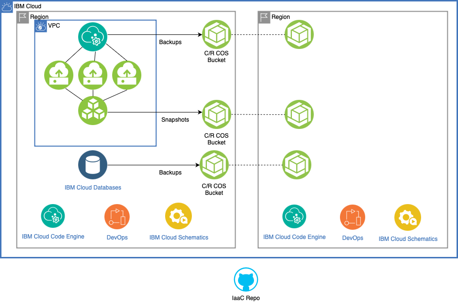
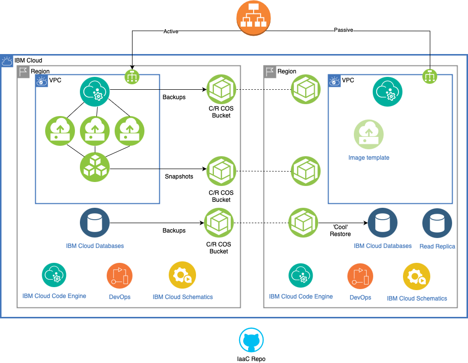
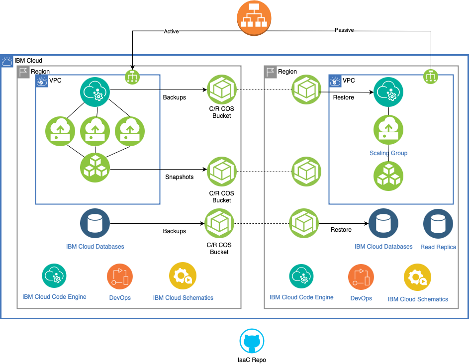
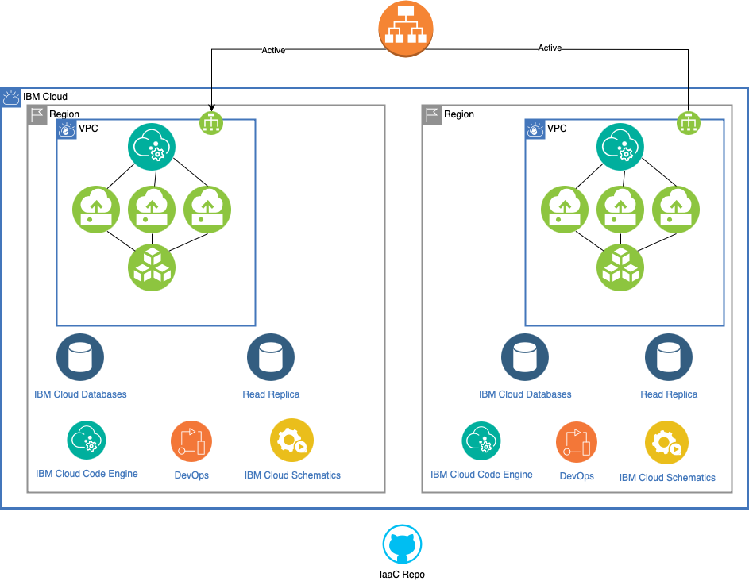

---

copyright:
  years: 2024
lastupdated: "2024-10-31"

keywords: disaster recovery, dr

subcollection: resiliency

---

{{site.data.keyword.attribute-definition-list}}

# Disaster recovery approaches within {{site.data.keyword.cloud_notm}}
{: #dr-approaches}

This page outlines four general approaches or strategies to disaster recovery (DR) support a disaster recovery plan. Depending on your use case, you can mix and match the these based on the workloads, environments, and Recovery Time Objectives (RTO) and Recovery Point Objectives (RPO) values that the business assigns.

The four DR approaches focus on VPC and database services in particular. Of course, many other services are available from {{site.data.keyword.cloud_notm}}, but the same general principles apply. To choose an approach, it’s important to understand if and how backups of your data - the data you are responsible for restoring - are taken within the service. Make sure that you understand how the backups are available to you, how they can be recovered, and where there can be recovered.

As an example, crucial systems, which tolerate zero downtime should run in an active or active cross-regional configuration, as detailed in Approach 4. Maintaining systems in such a configuration involves most cost and effort, so Approach 3 is appropriate for workloads where a few hours downtime can be tolerated, which in turn reduces the overall cost. Approach 1 is only suitable for systems that can tolerate extended downtime – such as noncritical development and test environments – but again, it’s a means to reduce the DR overhead by using the rapid scaling features of cloud computing. Approach 2 builds on the first approach but has some components that are built out, particularly those that can take time to deliver. So, when considering the DR plan and strategy, consider a mix and match approach, especially where budget is a constraint.

If the service automatically takes backups of your data, including snapshots, help ensure that they are placed in cross-region or buckets that are replicated to another region. This might be done by the service, or you might need to configure such replication. If the service does not automatically take backups of your data, be sure to understand how backups can be taken and stored. Remember, the {{site.data.keyword.Bluemix_notm}} shared responsibility model states that it is the customer's responsibility to help ensure that they have backups of their data, and to help ensure that it is recoverable. Review the {{site.data.keyword.Bluemix_notm}} docs for more service-by-service information.

Another consideration to note is the scope of the recovery that you attempt for any given disaster. While this guide may focus on a complete outage of a region, requiring full recovery elsewhere, outages that invoke disaster recovery plans may only befall one or a small number of cloud services. In these cases, consider your approach and the scenarios that you have planned for. Does your plan allow for the recovery of one or more cloud services in isolation, or does it demand that all services are recovered elsewhere, regardless? If you do just recover a single service, how will your workloads react and perform? What configuration changes might be needed and how easy are they to complete? Key to this is working through different disaster scenarios, that enrich your planning accordingly.

There is, of course, a silent fifth approach: wait for the affected region or service to be recovered by {{site.data.keyword.cloud_notm}}. This is a valid path but rememeber that it may take many hours or longer (depending on the cause of the outage) for recovery to complete in the affected region and you may still need to spend futher time restoring your data and so forth, in accordance with the shared responsibility model.

## Approach 1: Zero Footprint
{: #Approach1-ZeroFootprint}

With a zero DR footprint, this approach has the longest overall recovery time, though it does have the lowest cost profile. For many organizations, this is not an acceptable approach for production workloads, but it might be considered for development, system test workloads, or other workloads that need a disaster recovery provision but are low on the list of recovery priority. That said, unless you adopt a read replica instance, this is effectively the only way to recover an IBM Cloud Database service.

By using this approach:

* No infrastructure or services are present at a second region. Everything is re-created if a disaster occurs.
* Server-based data is backed up using a cross-region snapshot.
* Database data is recovered by using database backups.
* Use of Infrastructure as Code through IBM Cloud Schematics is highly recommended, as is the use of toolchains to deploy application code.
* Suitable for least stringent RTO and RPO, though some support for point in time recovery is available for certain databases.
* Allows for recovery from data corruption
* This is the least cost approach.

To enable an accurate and faster rebuild of the environment, create and use a toolchain that deploys infrastructure services by using {{site.data.keyword.bplong_notm}}. Then, deploy code to those services by using Git-based code repositories.

To backup and replicate data, which is written to block storage volumes or file storage, use Backup for VPC and store as cross-region backup snapshots and file storage replication in the first instance. Optionally, deploy and configure a Veeam agent on each server or a central Veeam Backup and Replication server or similar ‘bring your own’ backup software.  Depending on the chosen tool, devise a suitable backup or replication schedule. If you decide to use Veeam, write backup files to a IBM Cloud Object Storage bucket. The bucket should be cross-regional or, where compliance needs dictate, be configured for replication to another specified bucket hosted in a second region of choice.

For VSIs running Linux operating systems, the bucket can be mounted directly by using `s3fs`, based on FUSE. For VSIs running Windows, rclone is the preferred tool for direct mounting.  In each case, the bucket is mounted as a network drive and operates in a similar way to a CIFS or NFS shared drive. The installation of the Veeam agent and the bucket mount can be scripted and automated at the VSI provision time, by using the user-data settings. Be sure to use the appropriate endpoint for the bucket.

More complex application data should be stored within a database and IBM Cloud offers several that are suitable for most workloads.
{: note}

If you are using IBM Cloud Databases for MySQL, IBM Cloud Databases for PostgreSQL, or IBM Cloud Databases for MongoDB, point in time recovery from backups is available. Simply put, this works by a full backup being taken, with subsequent transactional changes being recorded, until the next full backup is taken. This means that when recovering the database, a date and time within the past 7 days can be chosen and the nearest full backup taken prior to that time is restored into a new instance before recorded transactional changes are replayed, up to the desired point in time. The very latest point in time for the recovery is that when the last transactional change was recorded and is available from the source database. Note that restores of this kind are rolled forward, but not backwards. Other databases are recoverable to the point of last backup, meaning they do not then have additional transactional changes applied to them. Backups are automatically taken every 24 hours and backup files placed in a cross-regional object storage bucket for resiliency. Recovery is possible to any other multi-zone region, except across compliance zone boundaries and note that database restores can take several hours to complete.

As well as the automatic database backups, customers can take on-demand backups too. Since automatic backups are taken once every 24 hours, this can result in the loss of up to 24 hours-worth of transactions when restored, if point-in-time restores are not available. Customers wishing to reduce that up to 24 hour figure, are therefore encouraged to take additional on-demand backups. On-demand backups can either be taken through the console or by using a CLI or API call, which means they can be automated through a job by using, for example, IBM Cloud Code Engine. All on-demand backups are also written to a multi-region object storage bucket.

If you are using another, bring your own database, refer to product documentation on the most suitable backup method. Generally, back up the data to a cross region object storage bucket, including any logs that provide point in time recovery.

{: caption="Diagram depiting an example architecture for a zero footpring DR solution" caption-side="bottom"}

## Approach 2: Basic Standby
{: #DRApproach2-BasicStandby}

Using this approach:

* Limited infrastructure is stood up and ready in a second region.
* Networking infrastructure that has longer lead times such as global load balancers, Direct Link, VPNs or similar, should be stood up and ready.
* Limited VSI images may be created and shut down, attracting minimal cost.
* Use autoscaling groups to bring up services more quickly.
* Use read-replica databases, where they are supported.
* Provides a faster RTO, compared to Approach 1 since some services are pre-created, though incurs a higher cost.

This approach differs from Approach 1 because some elements of the DR environment are built out, particularly networking services that have a longer lead time. This helps reduce the RTO if DR is called. This is a lower cost option compared to maintaining a full active and passive DR environment.

Consider using Infrastructure as Code (IaC) to capture production infrastructure changes in a single source repository for accurate replication in the DR region. Use this code to deply elements such as the VPC into the DR region. This includes the layout of the VPC networks and elements such as access control lists, security groups, and more. This increases overall operational overheads, since changes to the production environment must be rolled out to the DR environment to ensure consistency and problems with mis-configuration are not encountered if DR is called.

While calling for a slightly more complex IaC and scripting approach if fully automated, single servers of each type that are used in the deployment can be provisioned, configured and shut down. Runtime costs are then avoided but there are charges made for any storage that's consumed. This approach can enable a faster RTO for some services, where instances can be switched on and then scaled using instance templating and autoscaling techniques.

To avoid delays associated with lead times, certain networking elements should be created. These include items such as Direct Link, which can have significant lead times, VPN connections, and global load balancers. While this adds to ongoing costs, it does reduce overall recovery times as configurations can be put in place to quickly re-route traffic to the new region, without needing to make connection changes at the client end.

As before, to backup and replicate data which is written to block storage volumes or file storage, use Backup for VPC and store as cross-region backup snapshots and file storage replication in the first instance. Optionally, deploy and configure a Veeam agent on each server or a central Veeam Backup and Replication server or similar ‘bring your own’ backup software.  Depending on the chosen tool, devise a suitable backup or replication schedule. If you decide to use Veeam, write backup files to a IBM Cloud Object Storage bucket. The bucket should be cross-regional or, where compliance needs dictate, be configured for replication to another specified bucket hosted in a second region of choice.

It’s possible to create a read-replica database in the region chosen for DR for certain IBM Cloud databases. A copy of the database is maintained automatically in the second region, which can be turned into a stand-alone copy in the event of a disaster. This provides a lower RTO and asynchronous replication from the production database will typically limit any transactional data loss to under 15 minutes.

For other IBM Cloud Database services, the last backup must be restored to a new instance at the DR region, noting that some database types will allow point-in-time recovery within the past 7 days. For databases that don't allow point-in-time recovery, it’s recommended that on-demand backups are taken in addition to the automatic daily backup and these can be scheduled as a job using, for example, IBM Cloud Code Engine. Database restores can take several hours or more, and the time taken increases with the size of the database.

In each of these cases, data loss will depend on the time of the last available database backup, which could be up to 24 hours ago.

{: caption="Diagram depiting an example architecture for a basic standby DR solution" caption-side="bottom"}

## Approach 3: Minimal operation
{: #Approach3-MinimalOperation}

Using this approach:

* Minimal infrastructure is stood up and active in a second region, with autoscaling
* Networking infrastructure such as Direct Link, VPN, and global load balancers are in place
* Block storage data is frequently restored in the DR region from backups made using Backup for VPC or Veeam.
* Database read replicas are in-place, where available.
* Provides a faster RTO, since services are running and data is at least partially restored.
* Increases the cost.

This approach differs from approach 2 because a minimal service is maintained and running on the DR site, reducing RTO. This includes required networking fabric, such as Direct Link, VPNs, and global load balancers, which might otherwise have lead times of several days.

Data backups are applied to the active DR services at a frequency which supports a more aggressive RTO. It might be possible to automate this through jobs running on IBM Cloud Code Engine.

In the event of a disaster, the recovery of outstanding, unapplied backups is carried out and services are scaled to an appropriate level. If a read replica IBM Cloud Databases for service is used, the read replica is transitioned into a stand-alone copy.

{: caption="Diagram depicting an example architecture for a minimal operation DR solution" caption-side="bottom"}

## Approach 4:  Active/active
{: #Approach4-ActiveActive}

Using this approach:

* Two regions are built out and each is actively used.
* Databases maintain two copies, one per region.
* Provides a fastest RTO, since services are running.
* Increases complexity
* Most costly option

This approach basically means running two deployments, each of which is active. This affords little recovery time, other than scaling up resources at the surviving site but is more complex from a data point of view.

Managing changing application data is the most complex consideration with this approach. Where databases are used, a true active/active deployment has databases that are read and writable in two regions. In order to keep both copies in sync, the customer application must manage and ensure writes are successfull to both database instances.

{: caption="Diagram depicting an example architecture for an Active/Active solution" caption-side="bottom"}

## General DR guidance for common services
{: #general-dr-guidance}

Review the following sections covering general DR guidance for specific {{site.data.keyword.cloud_notm}} products and services. For more detailed guidance, visit specific DR pages in the service's documentation.

### IBM Cloud Object Storage
{: #IBMCloudObjectStorage}

Data that is stored in buckets should be periodically backed up to a second bucket location to protect against loss or corruption. This is a different use case to replication, since replication maintains the current state of a bucket, including deletions.

To perform a bucket backup, the current method is to use `rclone`. rclone creates a simple, point in time copy of the bucket. rclone itself is a program which needs to be run from a compute node of some kind, with network access to the source and destination bucket.  The compute node can either be a local machine or a VSI based in the cloud. Both the source and the destination bucket must have public HMAC credentials configured to enable rclone to connect.

The backups are performed through the creation of a simple script, typically written in the python language. The script can be run manually on demand or set to automatically run through a job scheduler, such as cron.

Further instructions can be found at: [Moving data between buckets](https://cloud.ibm.com/docs/cloud-object-storage?topic=cloud-object-storage-region-copy).

### Virtual Private Cloud
{: #DRinVPC}

There are three ways to back up data within VPC, depending on storage type. Backup for VPC, file share replication, and Veeam.

#### Backup for VPC
{: #BackupforVPC}

VPC has a built-in service called Backup for VPC that's used to back up data on attached block storage volumes. This allows the user to create different backup policies based on different frequencies of backup. For example, static data will not need to be backed up at the same frequency to non-static data, which is likely to need several backups per day and so each data type will have a separate backup policy. Up to 10 backup policies can be created per region using Backup for VPC with up to four plans per policy, which can be edited or deleted as necessary.

VPC backups are based on data snapshots. Each is a cumulative snapshot, meaning that a snapshot only contains the changes made to data since the snapshot before it. Therefore, when restoring, multiple snapshots may need to be recovered. Snapshots can be stored as cross-regional copies, meaning that a copy of the snapshot is stored in a second region. When enabling cross-regional copies, it means that a volume can be can be created from the snapshots in a target region, so this can be used in a disaster recovery situation.

Backup snapshots are taken at the volume level and both boot and data volumes can be targeted. A backup policy will have targets added to it and plans within policies can make backups more granular, with different backup points. The most granular backup point that can be defined is once per hour, via a cron expression.

In terms of DR, the backup snapshots can be used to create new VSIs in the DR region (assuming the boot volume has been backed up) and volumes can created / recovered and attached, again using the backup snapshots. If there are multiple block storage volumes attached to the VPC and they all need to be backed up and then recovered to the same point in time, then a consistency group must be used.

In general, backup snapshots offer a good way to capture VSI state for recovery in a second region, in particular boot volume state, but the more backup snapshots that need to be recovered, the slower the process.

#### File Share Replication
{: #FileShareReplication}

While Backup for VPC offers a data replication solution for block storage, file share replication offers a solution for VPC file storage. Once a file share has been created, it's then possible to configure replication for that share, including to another region in the same geography. This replication is asynchronous and the synchronisation frequency is set by the customer using a cron expression, allowing the most frequent replication to be once per hour.

#### Veeam
{: #VPCVeeam}

VPC VSIs can also be backed up using Veeam, which is a third party offering. Veeam is backup and recovery software, which enables users to create much more nuanced backups and recovery, down to the individual file level, compared to snapshots which just create an image of the entire disk, which must be recovered in its entirety. In other words, Veeam allows users to backup and restore single or multiple files, while leaving others alone.

The recommended approach to Veeam on {{site.data.keyword.cloud_notm}} with VPC instances is to install and configure a Veeam agent on each instance. The agent can then be configured to backup the VSI. The backup file that it creates should be written or copied into an Object Storage bucket, which can be attached directly to the VSI.

An alternate recommended approach, where this is a larger deployment of VSIs, is to have a centralized VSI running Microsoft Windows and install Veeam Backup and Replication software to manage backups for multiple server instances, including those running Windows and Linux operating systems.

### VMware Services on IBM Cloud
{: #VMwareonIBMCloud}

IBM Cloud recommends the use of Veeam to back up VMware services on IBM Cloud. Veeam on IBM Cloud is offered as an add-on service for this purpose, although the Veeam on IBM Cloud serivce itself is operated via Veeam – in other words, it is a third party service, supported directly by Veeam.

The service can be deployed on either a Bare Metal Server (the only choice for Regulated Workloads), a public Windows Server-based VSI or a Windows Server VM in the VMware management cluster.

By default, backups are stored on Endurance (file) storage or local disk but optionally, Veeam can be configured to write to an Object Storage Bucket. Here, the user should configure either a cross-region bucket or a bucket with replication to a bucket in an alternate region to provide a capability for DR into another region.

VMware for vSsphere and VMware for vCenter environments can take some time to provision and configure. This should be considered when forming the DR plan and the build out of DR services.

### Container Services
{: #ContainerServices}

The approaches highlighted above largely concentrate on IBM Cloud VPC and IBM Cloud Databases For services. While many customer workloads include both VPC and databases (and by extension, Bare Metal Servers and Classic Infrastructure) many others will be based around container services that include IBM Cloud Kubernetes Service (IKS) and Red Hat OpenShift on IBM Cloud.

In terms of cluster infrastructure, the four approaches discussed above generally hold, from having a zero DR footprint through to having active/active clusters. Care needs to be taken with storage choices though.

Both IKS and Red Hat OpenShift on IBM Cloud can be configured with persistent and non-persistent storage. Non-persistent storage is only used to store ephemeral data, so when non-persistent storage is lost, its data is not retained. Disaster recovery does not concern itself with the recovery of non-persistent storage for this reason.

Persistent storage, on the other hand, is used for data that needs to exist and be kept beyond the lifespan of the container, worker node or cluster that it is attached to and so does come into the scope of disaster recovery.

The means to create DR recoverable copies of persistent data, depends on the type of storage used. The table below provides details.

| Type | Backup Strategy | Replcation Strategy | Suitable RTO/RPO |
| --- | --- | --- | --- |
| Classic File Storage (NFS) | Backup to Object Storage via a backup and restore pod | Bucket replication | RTO minutes to hours, RPO to point of last backup and replication |
| Classic Block Storage | Backup to Object Storage via a backup and restore pod | Bucket replication | RTO minutes to hours, RPO to point of last backup and replication |
| Object Storage |  | Bucket Replication or use a Cross-regional bucket | RTO minutes to hours, RPO to point of last replication |
| Block Storage for VPC |	Use `kubectl cp` to copy files to Object Storage, or use snapshots | Bucket Replication or use a Cross-regional bucket |	RTO minutes to hours, RPO to point of last backup & replication |
| File Storage for VPC	| Use `kubectl cp` to copy files to Object Storage, or use snapshots	| Bucket Replication or use a Cross-regional bucket	| RTO minutes to hours, RPO to point of last backup & replication |
| Portworx (with DR recovery Plan) |	Asynchronous DR	| Clusters deployed in two regions, each with Portworx installation	| RTO minutes to hours, RPO up to 15 mins |
| Portworx – PX-Backup |	Backup / recovery software |	Portworx only	 | Point of last backup & replication |
|OADP - OpenShift Operator backup/recovery software |	Write backup to Object Storage bucket	Bucket | Replication or use a Cross-regional bucket |	RTO minutes to hours, Point of last backup & replication |
| Valero – Open source tool for backup / recovery / DR for Kubernetes |	Write backup to Object Storage bucket |	Bucket Replication or use a Cross-regional bucket |	RTO minutes to hours, Point of last backup & replication |
| Veeam (OpenShift ony)	| Write backup to Object Storage bucket |	Bucket Replication or use a Cross-regional bucket	| RTO minutes to hours, Point of last backup & replication |
{: caption="Backup and replication strategy by storage type" caption-side="top"}

For critical container-based applications, Portworx Asynchronous DR is the recommended approach for persistent storage since this provides the simplest means to replicate data to a second site and potentially the shortest recovery time.

IBM Cloud takes care of backups at the control plane level – this is essentially a backup of the etcd database in the master cluster, which contains configuration information.

To backup applications that have been deployed, use the ‘backup’ custom resource within OpenShift. IKS users need to bring their own backup solution such as Kasten or use Portworx.

### IBM Cloud Databases
{: #ICD}

Backups are automatically taken of IBM Cloud Databases once per day and are retained and available for 30 days thereafter, unless the database instance itself is deleted, in which case the backups are also removed.

Backups are placed in a cross-regional Object Storage bucket, which enables them to be restored in any region (though not across compliance boundaries) and even across accounts, if using the API and sufficient account access is granted. Note backups cannot be downloaded - if local copies are needed, then a database flavour specific backup tool is needed. To guard against malicious deletion of a database service, having a local backup is advisable.

Such backups provide ‘at the time of the backup’ restoration points. If a different restoration point is required (i.e. with less than up to 24 hours data loss), then ‘on demand’ backups can be taken either through the console or via CLI or API. Using the CLI or API means they can be scheduled using cron, for example.

A few IBM Cloud Databases (including MySQL, PostgreSQL, EnterpriseDB and MongoDB) also provide Point-in-Time recovery, meaning that they can be restored to a particular timestamp within the past 7 days. These work by taking a full backup and then recording transactions that change the database, until the next full backup is taken. When a restore action is performed, the last full backup prior to the requested restore point is recovered and then recorded transactions are replayed on the data, up to the point in time specified.

A point to remember with IBM Cloud database backups is that backups can only be restored by creating a new instance - you cannot have an existing instance and apply backups to it in a cumulative manner. The tine it takes to fully restore a database may range from minutes, to hours, even to days, depending on the amount of data that it stores. It's therefore important to test restores to have some indication as to how long the restore process might take, baring in mind, this may still only provide a rough indication, since restores can be affected by many different factors. If the restore process is longer than desired, then consider breaking the database down into several, smaller instances or taking other actions - such as purging old data - which has the effect of reducing the overall size of the database.

A number of IBM Cloud Databases, including PostgreSQL, EnterpriseDB and MySQL, also support Read-only Replicas. These are replicated databases that are set up in a Master / Replica configuration where the master sends changes to the replica and those changes are applied to the replica instance asynchronously. Under normal operation, the replica can only be used for read transactions, so can support read-intensive operations, such as reporting. In a DR situation, a read-only replica can be promoted to a read-write, stand-alone instance, with and RTO/RPO of minutes. Once completed, client connection strings will need to be redirected to this instance.

While loss of the database is one scenario to consider, another is corruption of the data it stores. Data corruption within databases can be caused by multiple means, inculding malfunctioning software, bad disks and even through the hands of users, whether accidental or deliberate. Sometimes this corruption can be quickly identified, other times, it may take a lot longer for a data problem to be spotted. Remember that if you rely solely on read-replica databases for disaster recovery, then it is likely the replica will also contain any data corruption, which may be difficult to reverse, if at all - so taking backups as well as having read-replicas is advised. It's therefore important to think about how data corruption might affect the databases your workloads rely on, and how to recover from that corruption. If the corruption is discovered quicky, then using database backups taken before the corruption occured may be a way to recover. If the corruption is discovered more slowly, then other means of repair may need to be considered, such as scripting to directly fix data. The tactic deployed will usaully depend on factors such as potential for data loss.

### IBM Cloudant
{: #IBMCloudant}

While IBM Cloudant instances are highly available, they still require backup to protect against accidental or malicious data loss or corruption. Backup and recovery tooling is not provided as part of the IBM Cloudant dashboard but IBM Cloud recommends the use of CouchBackup, which is an open source, command line tool that is simple to download and use.

CouchBackup can either be used in one-off operations or its use can be scripted and driven by cron or a similar scheduler. Backups are written to files which can be uploaded to an IBM Cloud Object Storage cross-regional bucket or a bucket that is otherwise replicated.

CouchBackup provides recovery to the point of the last backup.

Additionally, IBM Cloudant allows the configuration of replication for cross-regional disaster recovery, where replication can either be one-way or bi-directional. Replication should not be relied on for all disaster scenarios, since data corruption and deletes will be propagated to the replicated version of the database.
