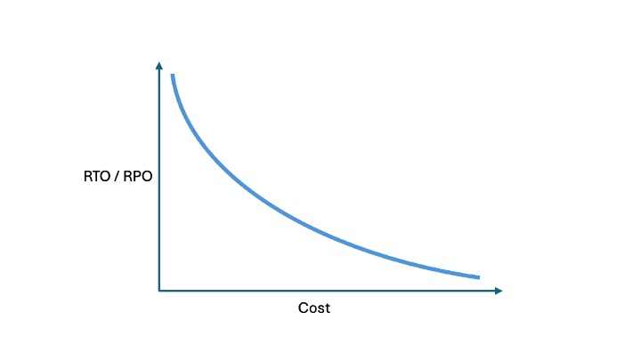

---

copyright:
  years: 2021, 2024
lastupdated: "2024-11-16"

keywords: disaster recovery, DR, what is disaster recovery, DR strategy, disaster recovery options, disaster recovery strategy

subcollection: resiliency

---

{{site.data.keyword.attribute-definition-list}}

# Understanding disaster recovery
{: #understanding-dr}

When you design and build IT workloads, much focus is often placed on maintaining [high availability](#x2284708){: term} (HA). HA is the process of designing out single points of failure so that workloads can survive and avoid outages that are otherwise caused by failing infrastructure.
{: shortdesc}

{{site.data.keyword.cloud_notm}} supports high availability through its multizone region (MZR) architecture. HA is a design default in many {{site.data.keyword.cloud_notm}} services. This means you can easily deploy workloads across multiple zones in a region. The multi-zone deployment model means that even the complete failure of a single zone doesn't affect workload availability - assuming that the workload is correctly deployed.

But disasters are different. Disasters cause a workload to go down despite attempts to make it highly available. The worst disasters have widespread consequences, meaning that the affected workloads might require recovery in a different region altogether.

## What does disaster recovery mean?
{: #disaster-recovery-what-is}

[Disaster recovery](#x2113280){: term} (DR) is defined as the process of recovering one or more workloads to a working state in a second {{site.data.keyword.cloud_notm}} region, following an unplanned outage. High availability does not equate to disaster recovery. They are different things.

To illustrate recovery to a second region, consider a scenario. Under normal circumstances, a customer runs their workloads in the {{site.data.keyword.cloud_notm}} `us-south` multizone region. Then, a major disaster occurs which affects and causes a prolonged outage for the whole of the `us-south` region. In such cases, returning to normal operation at `us-south` might take hours, days, or even months, depending on the scale of the outage. If the affected cloud workloads are critical to business operations, lengthy periods of downtime leave the customer little option but to recover and run their workloads in a second {{site.data.keyword.cloud_notm}} region.

Such circumstances typically result from a widespread issue, affecting a large geographical area, including natural disasters or regional or national emergencies. Disasters of this type have a low occurrence probability. Usually, {{site.data.keyword.cloud_notm}}’s MZR architecture provides adequate protection against zonal failure and the failure of a whole region is unlikely. {{site.data.keyword.cloud_notm}}’s SLA for services that are deployed over an MZR is typically 99.99%, which equates to just over 52.5 minutes of unplanned downtime per year. For more information, see [{{site.data.keyword.cloud_notm}} Service Level Agreements](/docs/overview?topic=overview-slas).

However, as a customer, a small chance exists that a disaster can take out the region where your critical workloads are running. It’s best to be prepared if you want to avoid extended periods of downtime caused by disasters.

## RTO and RPO
{: #RTO-RPO}

[Recovery Time Objective](#x3167918){: term} (RTO) and [Recovery Point Objective](#x3429911){: term} (RPO) are often the two starting points for a disaster recovery plan.

When a disaster is called and the disaster recovery plan is enacted, the clock starts ticking on RTO. RTO refers to the time that it takes to restore services to a usable state. A plan can have an overarching RTO, which covers many workloads, and individual RTOs for each workload it covers. RTO is expressed as units of time, for example minutes, hours, or days.

RPO refers to the point in time to which services are restored. Often, it's desirable to recover to the point of failure to minimize data loss. Recovering from a data corruption an earlier RPO is desirable, to a point in time before the corruption was introduced. Also, where multiple workloads are interconnected, it can be important that each system is bought back to the same point in time. RPO is expressed as to the point of failure or zero data loss, or to the point of last backup or somewhere in between. Constraints on RPO include technical feasibility and the cost of implementation.

Many environments have a mix of workload types, some which are fundamentally critical, some which are less so. Some complex environments might also have many dependencies on other workloads, where one workload needs another to operate. These aspects contribute to setting RTO and RPO targets for individual workloads. Create a recovery plan timeline, which considers the order in which workloads need to be recovered. The timeline must account for a workload's importance to the business, its resource requirements, complexity, and dependencies.

Typically, costs rise as RTO and RPO targets reduce toward zero. Workloads that have the most stringent RTO and RPO targets are the most business critical. This ratio is depicted in the following diagram.

{: caption="Diagram depicting RTO/RPO to Cost ratio" caption-side="bottom"}

## A general strategy for disaster recovery
{: #bcdr-general-strategy}

The approach to defining your DR strategy needs to be systematic and start with the application or workload and the cloud service types they use. It is tempting to set a single RTO/RPO target for all workloads but the reality is that each business workload is independent and has its own RTO and RPO requirements. Many customers use a set of workload classes, where each class has a set RPO/RTO.

Each business workload employs a set of cloud resources. Its requirements for DR must be understood, documented, and implemented before release to production. It is more difficult to 'retro-fit' a DR solution than to design the workload with a DR solution in mind in the first place.

### DR strategy options
{: #dr-categories}

Many options to implement DR solutions exist. For the sake of simplicity, the different options are grouped in four major categories:

Zero Footprint
:   Zero Footprint sees the full application stack active in one location, with the ability to recover the application stack in another location but where nothing at all is built-out. In practice, verify that all backups are available in the second location for recovery. If a disaster strikes, all services are provisioned (preferably from Terraform templates or similar) from the ground up before backups are applied. Zero footprint is the least-cost. Since services are provisioned from scratch, it is only suitable where RTO and RPO objectives are at least several hours in length.

Basic Standby
:   Basic Standby options keep the full application stack active in one location, while another application stack is deployed but kept shut down in a different location. If a prolonged outage in the primary location occurs, the application stack is activated in the second location and backups are recovered. Expect a recovery time of several hours to instantiate and recover workloads that use this model. If the availability of the workload is critical and the RTO objective is less than a few hours, this approach is not be optimal.

Minimal Operation
:   Minimal Operation means that the full application stack is active in both the primary and backup location but user transactions are processed at the primary location only. Data replication, such as database replication or disk replication, keeps the backup location in sync. In cases of prolonged unavailability of the primary site, all client transactions are routed to the backup site. This approach provides an RPO and RTO that can be measured in minutes. Minimal operation is more expensive than the Active/Passive options because of the double deployment. For example, resources are wasted because the standby assets can't be used to improve scalability and throughput.

Active/Active
:   Active/Active means that both locations are active, and client transactions are distributed to both regions according to predefined policies, such as 'round-robin' or 'geographically closest'. If a site fails, the other site must be able to serve all clients. It's possible to achieve both an RPO and RTO close to zero with this configuration. Use of autoscaling is key to help ensure that enough resources are available, based on current load. If a region fails, the remaining region must quickly scale to exclusively handle full load. The data across the two sites is continuously synced with a replication mechanism. Relying solely on this approach is problematic in instances where data corruption or loss is the root cause of the disaster, due to replication. Resolving such disasters still relies on recovering backups that include the non-corrupted or lost data.

### Plan and design for various scenarios
{: #worst-conditions}

Bear in mind that disasters have many forms and require different techniques to counter them. The means to recover from a complete region outage is different from how recovery from data corruption is achieved. Good design does not consider a single scenario, but different alternative scenarios that provide recovery from several perceived faults.

Consider carefully what you need to recover if a disaster strikes. Do you need every workload or just a subset of core applications? Is there an order that they need to be restored in? Is data consistency across workloads important? Is it possible to work in a degraded state and if so, for how long?

These questions are as much a business consideration as a technical one, and costs might be prohibitive in some situations. You must have a clear view of what the minimal acceptable recovery is that allows the business to function, accepting residual risks from understanding their consequences. Planning the technical solution must work hand-in-hand with business requirements and both must be captured in the disaster recovery plan. For more information, see [Planning for disaster recovery](/docs/resiliency?topic=resiliency-PlanningforDR).
