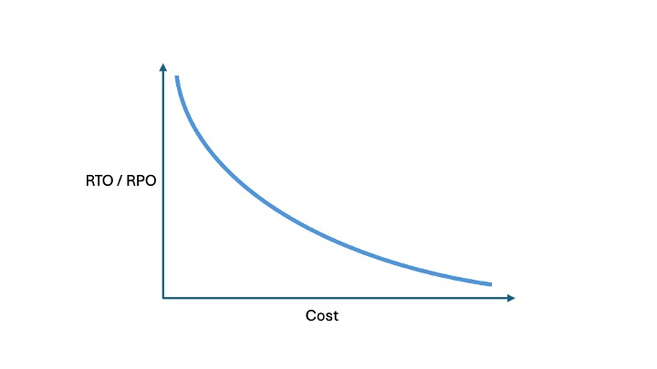

---

copyright:
  years: 2021, 2024
lastupdated: "2024-10-22"

keywords: disaster recovery, DR, what is disaster recovery, DR strategy, disaster recovery options, disaster recovery strategy

subcollection: resiliency

---

{{site.data.keyword.attribute-definition-list}}

# Understanding disaster recovery
{: #understanding-dr}

When designing and building IT workloads, there's often much focus on maintaining [high availability](#x2284708){: term} (HA), which is the process of designing out single points of failure, so that workloads can survive and avoid outages that are otherwise caused by failing infrastructure.

{{site.data.keyword.cloud_notm}} supports high availability through its multizone region (MZR) architecture. This is baked into many {{site.data.keyword.cloud_notm}} services and it allows customers to easily deploy workloads across multiple zones in a region, where even the complete failure of a single zone won’t affect the availability of a workload - assuming the workload has been correctly deployed to take full advantage of the MZR.

But disasters are different. Disasters will cause a sworkload to go down despite attempts to make it highly available and the worst disasters will have widespread consequences, meaning that the affected workloads may require recovery in a different region altogether.

## What's meant by 'disaster recovery'?
{: #Intro-whatIsMeant}

For the purposes of this guide, [disaster recovery](#x2113280){: term} (DR) is defined as the process of recovering one or more workloads to a working state in a second {{site.data.keyword.cloud_notm}} region, following an unplanned outage. Remeber, high availablity does not equate to disaster recovery. They are different things.

To illustrate recovery to a second region, think of this scenario. Under normal circumstances, a customer runs their workloads in the IBM Cloud us-south multizone region. Then, a major disaster occurs which affects and causes a prolonged outage for the whole of the us-south region. In such cases, returning to normal operation at us-south may take hours, days or even months depending on the scale of the outage. Depending on the criticality of affected cloud workloads to business operations, this leaves the customer little option but to recover and run their workloads elsewhere, namely a second IBM Cloud region.

As suggested, these circumstances will typically occur where there is a widespread issue, affecting a large geographical area, such as natural disaster or a regional or national emergency – and so disasters of this type in themselves have a very low occurrence probability. In the vast majority of cases, {{site.data.keyword.cloud_notm}}’s MZR architecture provides adequate protection against zonal failure and the failure of a whole region is extremely unlikely. {{site.data.keyword.cloud_notm}}’s SLA for services deployed over an MZR is typically 99.99% - which equates to just over 52-and-a-half minutes unplanned downtime per year (note this is per service, not for the entire environment) - and the services are architected accordingly. See [{{site.data.keyword.cloud_notm}} Service Level Agreements](/docs/overview?topic=overview-slas) for details of {{site.data.keyword.cloud_notm}}'s SLAs.

However, as a customer, there is still a small chance that a disaster could take out the region where your critical workloads are running, so it’s best to be prepared, if you want to avoid extended periods of downtime that are caused by disasters.

### Why is High Availability not Disaster Recovery? Do I need both?
{: #WhyIsHAnotDR}

Many will confuse high availability with disaster recovery, but they are distinctly different.

Designing high availability into a workload is an effort to prevent a workload from failing. For example, spreading data over multiple disks in a RAID array is an effort to prevent an outage caused by disk failure. Multiple power supplies in a server is an effort to prevent a failure caused by an outage in a power circuit, while running applications across multiple servers in different zones is an effort to prevent an outage caused by a server failure and zone failure. And so on.

Disaster recovery is the practice of recovering a workload once it has failed, despite the availability of resources at its disposal.

For example, a workload may be highly available and resilient to failure because it runs across multiple hardware devices in multiple data centers. This may afford the system 99.999% availability but it’s still susceptible to disasters such as accidental or malicious data erasure, or a natural disaster that takes out a wide area that includes all the data centres.

As a general rule of thumb, the more highly available a workload needs to be, the more valuable and vital it is to the business. Since it’s vital to the business, the more likely the need for it to have a well-documented, stringent disaster recovery plan.

### What counts as a disaster?
{: #WhatCountsasaDisaster}

An IT disaster is an event that causes serious disruption to the functioning of an application or environment that goes beyond its ability to survive. These can be short- or long-term events but their effect is typically damaging to the business, either financially, reputationally or both.

Such events will normally be the result of:

* Natural disasters such as flood, fire, earthquakes
* Infrastructure problems such as power outages, broader network failures
* Accidental or malicious actions that delete data, services, or configuration
* Rolling out a software update which contains a bug or other error that was not anticipated

In each event, it is important to have a planned recovery approach that provides for the restoration of service within a given timeframe, to an agreed point in time before the disaster occurred. It’s probably also advisable to be aware of the costs involved too - both in terms of the cost of downtime to the business and the cost of the solution put in place.

### Can I just do DR in the same region?
{: #CanIDRintheSameRegion}

The short answer to this is yes – but in practical terms, it comes down to how quickly recovery is needed for your circumstances. In practice, true DR should take place in a separate region.

{{site.data.keyword.cloud_notm}} will always seek to recover services within the region, in line with any published SLOs. This may take minutes or hours but in the very worst-case scenarios, perhaps where there has been physical destruction of property, it may take many days, perhaps even weeks or months, to achieve.

In {{site.data.keyword.cloud_notm}}, if there is an outage where {{site.data.keyword.cloud_notm}} calls a disaster, {{site.data.keyword.cloud_notm}} may have to recover services before you can recover your workloads. If this is the case, you need to add the time it will take for {{site.data.keyword.cloud_notm}} to complete its recovery to the time it takes to do yours. Bear this in mind when deciding whether to rely on just a single region.

### Do all disasters require recovery in a second region?
{: #Intro-DoAllDisasters}

Not all disasters require recovery at a second region. A DBA may accidentally drop a database table; an automated release may go catastrophically wrong; an essential managed cloud service stops functioning correctly; a disgruntled employee acts. In these cases, data recovery is key and depending on how widespread the issue is, how prepared the organisation is and how quickly recovery needs to be achieved, such a disaster may not force failover to another region. So, depending on the scenario, recovery could be acheived in the same region. For this reason, it's important to consider multiple disaster scenarios, and to plan accordingly.

### RTO and RPO
{: #RTO-RPO}

[Recovery Time Objective](#x3167918){: term} (RTO) and [Recovery Point Objective](#x3429911){: term} (RPO) are often the two starting points for a disaster recovery plan, though disaster scenarios that could befall the business and their workloads, should also be considered. These disaster scenarios will help shape and determine the steps needed to recover from them and also provide some indication as to what needs to be happening for the business to declare a disaster and put the plan put into action.

RTO refers to the maximum time that it should take to restore services to a usable state once a disaster is called and the disaster recovery plan is enacted. Note that a plan can have an overarching RTO, which covers many workloads, as well as individual RTOs for each workload it covers. RTO is generally expressed in terms of minutes, hours or days.

RPO refers to the point in time to which services should be restored. Often, it is desirable to recover to the point of failure, as this provides minimal data loss but there are times, such as when recovering from a data corruption, when an earlier RPO is desirable. Also, where multiple workloads are interconnected, it can be important that each of those systems are bought back to the same point in time. RPO is generally expressed as ‘to point of failure’ (or zero data loss), or ‘to the point of last backup’, or somewhere in between. Remember that RPO may also be constrained by what's technically possible, as well as cost.

Many environments will have a mix of workload types, some which are fundamentally critical, some which are less so. Some complex environments may also have many dependencies on other workloads, where one workload cannot run without another. It is therefore important to consider these aspects too when defining RTO and RPO targets for individual workloads. Also, devise a recovery plan timeline which considers the order in which workloads need to be recovered, based on their importance to the business, available resources, complexity and dependencies.

Typically, costs will rise as RTO and RPO targets become lower, so as a rule of thumb, workloads that have the most stringent RTO and RPO targets will be those that are the most business critical. This ratio is depicted in the following diagram.

{: caption="Diagram depicting RTO/RPO to Cost ratio" caption-side="bottom"}

## General disaster recovery strategy
{: #bcdr-general}

The approach to defining your DR strategy needs to be systematic and start with the application or service, which is defined as a set of compute resources, for example Kubernetes apps, virtual machines, services, and more, that make up a business application.

While a holistic approach might be wanted, the reality is that each business application (cloud service) is independent, with its own RTO and RPO requirements, which for many customers is expressed in the form of a set of service classes.

Because each business application has a unique set of compute, services, and other resources, each one needs to be reviewed to make sure that the strategy and requirements for DR for that app are understood, documented, and implemented before going to production. It is usually more difficult to 'retro-fit' a DR solution to an application than to design the application with a DR solution in mind in the first place. To build the framework that will drive that analysis and work, we outlined profiles for continuous availability and advanced recovery applications with common sets of resources to create the scaffolding that application teams can use for their own applications. For more information, see [Designing an architecture for your application resiliency objectives](/docs/overview?topic=overview-bcdr-app-recovery).

### DR strategy options
{: #dr-categories}

There are many options to implement DR solutions. For the sake of simplicity, we can group the different options in four major categories:

Active/Nothing
:   Active/Nothing sees the full application stack active in one location, with the ability to recover the application stack in another location but where nothing at all is actaully built-out. In practice, this means ensuring that all backups are available in the second location for recovery and should there be a situation where disaster strikes, all services will be provisioned (preferably from Terraform templates or similar) from the ground up before backups are applied. While this is the least-cost approach, it is only suitable where RTO and RTO objectives are at least several hours in length, due to the time it would take to provision and configure services.

Active/Passive
:   Active/Passive options are based on keeping the full application stack active in one location, while another application stack is deployed in a different location but kept idle or shut down. In the case of prolonged unavailability of the primary site, the application stack is activated in the backup site. Often that requires the restoring of backups that are taken in the primary site. This approach may not use continuous data replication, so is not recommended if recovery to the point of last backup (which may be some hours behind a disaster) is not appropriate for the workload - for example when the RPO is less than a few hours. It may also take some time to instantiate and recover the services when using this model, so the availability of the service is critical and the RTO objective is less than a few hours, this approach may not be optimal.

Active/Standby
:   In the Active/Standby case, the full application stack is active in both the primary and backup location. However, user's transactions are served by the primary site only. The backup site takes care of keeping a replica of the state of the main location through data replication, such as database replication or disk replication. In cases of prolonged unavailability of the primary site, all client transactions are routed to the backup site. This approach provides good RPO and RTO, generally measured in minutes; however, it is significantly more expensive than the Active/Passive options because of the double deployment. For example, resources are wasted because the standby assets can't be used to improve scalability and throughput.

Active/Active
:   In the Active/Active case both locations are active, and client transactions are distributed to both regions according to predefined policies, such as round-robin, geographical load balancing, and so on. In the case of the failure of one site, the other site must be able to serve all clients. It's possible to achieve both an RPO and RTO close to zero with this configuration. The drawback is that both regions must be sized to handle the full load, even if they are used at half of their capabilities when both locations are available. In such cases, auto scaling can help in keeping resources allocated according to the needs. Of course, the data across the two sites is continuously synced with some kind of replication mechanism. Relying soley on this approach is problematic in instances where data corruption or loss is the root cause of the disaster, since of course the corruption will be replicated between locations. To resolve such disasters still relies on data backups and recover of that non-corrupted or lost data.

### Plan and design for a number of scenarios
{: #worst-conditions}

When designing your disaster recovery solution, bear in mind that disasters have many forms and may require different techniques to counter them. For example, a complete and sudden region outage where data can be restored to-point-in-time to another region, may invoke a different course of action to a case where data corruption has been discovered, that could have been ongoing for some time and be present in data backups and data replication. So, your design should not only consider a single plan, but different alternatives to best adapt and be able to recover from a number of percieved faults.

Consider carefully what you bring back in the event of a disaster too. Do you need every workload or just a subset of core applications? Is there an order that they need to be restored in? Is data consistency across workloads important? Is it possible to to work in a degraded state and if so, for how long?

Of course, these questions are as much a business consideration as a technical one, and costs might be prohibitive in some situations. However, you should have a clear view of what the minimal acceptable conditions are, and what other aspects you might eliminate when a solution is cost prohibitive while understanding what the impact would be. In other words, accept residual risks knowing the consequences. Planning the solution should work hand-in-hand with business requirements and both should be captured in the disaster recovery plan. This is explored further in the Planning for Disaster Recovery topic.
