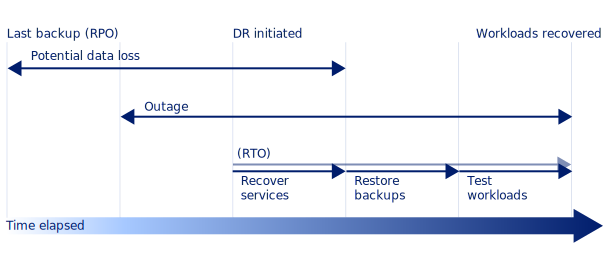
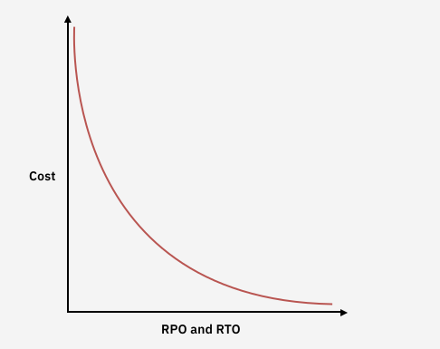

---

copyright:
  years: 2021, 2024
lastupdated: "2025-05-07"

keywords: disaster recovery, DR, what is disaster recovery, DR strategy, disaster recovery options, disaster recovery strategy

subcollection: resiliency

---

{{site.data.keyword.attribute-definition-list}}

# Understanding disaster recovery
{: #understanding-dr}

[Disaster recovery](#x2113280){: term} (DR) the process of recovering one or more workloads to a working state in a second {{site.data.keyword.cloud_notm}} region after an unplanned outage. High availability is not the same as disaster recovery.
{: shortdesc}

When you design and build IT workloads, focus is often placed on maintaining [high availability](#x2284708){: term} (HA). HA is the process of designing out single points of failure so that workloads can survive and avoid outages that are otherwise caused by failing infrastructure.

Disasters are different. Disasters cause a workload to go down despite attempts to make it highly available. The worst disasters have widespread consequences, which means that affected workloads might require recovery in a different region altogether.

## What does disaster recovery mean?
{: #disaster-recovery-what-is}

To illustrate recovery to a second region, consider a scenario. Under normal circumstances, a customer runs their workloads in the {{site.data.keyword.cloud_notm}} `us-south` multizone region. Then, a major disaster occurs which affects and causes a prolonged outage for the whole of the `us-south` region. In such cases, returning to normal operation at `us-south` might take hours, days, or even months, depending on the scale of the outage. If the affected cloud workloads are critical to business operations, lengthy periods of downtime leave you little option but to recover and run your workloads in a second {{site.data.keyword.cloud_notm}} region.

Such circumstances typically result from a widespread issue that affects a large geographical area, including natural disasters and regional or national emergencies. These types of disasters are unlikely to occur. Usually, {{site.data.keyword.cloud_notm}}’s MZR architecture provides adequate protection against zonal failure, and the failure of a whole region is unlikely. {{site.data.keyword.cloud_notm}}’s Service Level Agreements (SLA) for services that are deployed over an MZR is typically 99.99%, which equates to just over 52.5 minutes of unplanned downtime per year. For more information, see [{{site.data.keyword.cloud_notm}} Service Level Agreements](/docs/overview?topic=overview-slas).

However, the chance remains that a disaster can take out the region where your critical workloads are running. Be prepared with a disaster recovery plan if you want to avoid extended periods of downtime caused by disasters.

## RTO and RPO
{: #RTO-RPO}

[Recovery Time Objective](#x3167918){: term} (RTO) and [Recovery Point Objective](#x3429911){: term} (RPO) are often the two starting points for a disaster recovery plan. The following diagram describes how RTO and RPO fit into a simplified outage timeline.

{: caption="Diagram depicting how RTO/RPO fit into an outage timeline" caption-side="bottom"}

When an outage occurs, the business must decide whether and when to declare a disaster and put the disaster recovery plan into action. After you declare a disaster, the clock starts on RTO. RTO refers to the time that it takes to restore services to a usable state. A plan can have an overarching RTO, which covers many workloads, and individual RTOs for each workload it covers. RTO is expressed as units of time, for example minutes, hours, or days.

RPO refers to the point in time to which services are restored, which is usually the point of the last backup. When you recover from a data corruption, an earlier RPO to a point in time before the corruption was introduced is desirable. Where multiple workloads are interconnected, it's important that each system is bought back to the same point in time. RPO is expressed as to the point of failure or zero data loss, to the point of last backup, or somewhere in between. Constraints on RPO include technical feasibility and the cost of implementation. The outage lasts until service is restored to the end user.

Many environments have a mix of workload types, some that are fundamentally critical and some that are less critical. Some complex environments might also have many dependencies on other workloads, where one workload needs another to operate. These aspects contribute to setting RTO and RPO targets for individual workloads. Create a recovery plan timeline that considers the order in which workloads need to be recovered. The timeline must account for a workload's importance to the business, its resource requirements, complexity, and dependencies.

The following table provides an example RPO/RTO per example application classifications as a reference. Actual RPO/RTO and business classification depends on each organization.

| Business application class | RPO     | RTO      |
|--------------------------------|-------------|--------------|
| Platinum (Always on)           | Zero        | Near zero    |
| Gold (Almost Always On)        | \<= 15 mins | \<= 1 hour   |
| Silver (High availability)     | \<= 1 hour  | 4 - 8 hours  |
| Bronze (Moderate availability) | \<= 8 hours | \<= 24 hours |
{: caption="Example RTO/RPO values based on business application class" caption-side="bottom"}

Maintaining a DR provision has associated costs. The following diagram shows a typical DR cost curve. The nearer to zero the RTO and RPO target, the greater the cost of the solution that is needed. As RTO and RPO moves toward hours and even days, associated costs reduce. Workloads that have the most stringent RTO and RPO targets cost the most to protect and be the most business critical.

{: caption="Diagram depicting RTO/RPO to Cost ratio" caption-side="bottom"}

## Planning for a disaster
{: #bcdr-general-strategy}

The approach to defining your DR strategy needs to be systematic and start with the application or workload and the cloud service types they use. It is tempting to set a single RTO/RPO target for all workloads but the reality is that each business workload is independent and has its own RTO and RPO requirements. Many customers use a set of workload classes, where each class has a set RPO/RTO.

Each business workload employs a set of cloud resources. Its requirements for DR must be understood, documented, and implemented before release to production. It is more difficult to 'retro-fit' a DR solution than to design the workload with a DR solution in mind in the first place.

### Disaster recovery strategies
{: #dr-categories}

Many options to implement DR solutions exist. The different options are grouped into the following four major categories:

Zero footprint
:   Zero footprint sees the full application stack active in one location, with the ability to recover the application stack in another location but where nothing at all is built-out. In practice, verify that all backups are available in the second location for recovery. If a disaster strikes, all services are provisioned, preferably from Terraform templates or similar, from the ground up before backups are applied. Zero footprint is the least-cost strategy. Since services are provisioned from scratch, it's only suitable where RTO and RPO objectives are at least several hours in length.

Basic standby
:   Basic standby options keep the full application stack active in one location, while another application stack is deployed but kept shut down in a different location. If a prolonged outage in the primary location occurs, the application stack is activated in the second location and backups are recovered. Expect a recovery time of several hours to instantiate and recover workloads that use this model. If the availability of the workload is critical and the RTO objective is less than a few hours, this approach is not optimal.

Minimal operation
:   Minimal operation means that the full application stack is active in both the primary and backup location but user transactions are processed at the primary location only. Data replication, such as database replication or disk replication, keeps the backup location in sync. In cases where the primary site is unavailable for a prolonged period, all client transactions are routed to the backup site. This approach provides an RPO and RTO that can be measured in minutes. Minimal operation is more expensive than the Active/Passive options because of the double deployment. For example, resources are wasted because the standby assets can't be used to improve scalability and throughput.

Active/Active
:   Active/Active means that both locations are active, and client transactions are distributed to both regions according to predefined policies, such as 'round-robin' or 'geographically closest'. If a site fails, the other site must be able to serve all clients. It's possible to achieve both an RPO and RTO close to zero with this configuration. The use of autoscaling is key to help ensure that enough resources are available based on current load. If a region fails, the remaining region must quickly scale to exclusively handle the full load. The data across the two sites is continuously synced with a replication mechanism. Relying solely on this approach is problematic in instances where data corruption or loss is the root cause of the disaster, due to replication. Resolving such disasters still relies on recovering backups that include the non-corrupted or lost data.

### Designing for various scenarios
{: #worst-conditions}

Disasters have many forms and require different techniques to counter them. The means to recover from a complete region outage is different from how you achieve recovery from data corruption. Good design does not consider only a single scenario, but considers different scenarios that provide recovery from several potential faults.

Consider carefully what you need to recover if a disaster occurs. Do you need every workload or just a subset of core applications? Is there an order in which they need to be restored? Is data consistency across workloads important? Is it possible to work in a degraded state and if so, for how long?

These questions are as much business considerations as technical ones, as costs might be prohibitive in some situations. You must have a clear view of what the minimal acceptable recovery is that allows the business to function, accepting residual risks from understanding their consequences. Planning the technical solution must work hand-in-hand with business requirements and both must be captured in the disaster recovery plan. For more information, see [Planning for disaster recovery](/docs/resiliency?topic=resiliency-PlanningforDR).

### Read service specific documentation
{: #read-the-docs}

Each IBM Cloud service has its own documentation set. This includes a section on BCDR that is specific to that service. Ensure that you review and follow the guidance provided on those pages for each service that you use. For convenience, see [Service documentation for high availability and disaster recovery](/docs/resiliency?topic=resiliency-service-ha-dr) for specific service-by-service links.
