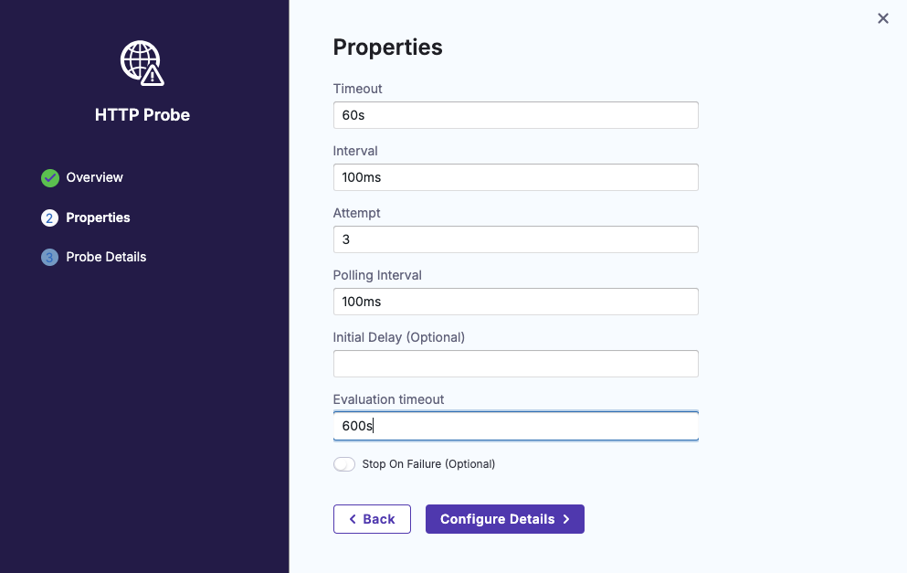
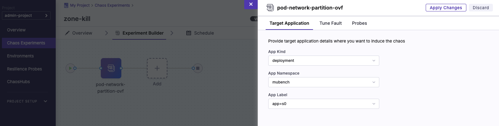
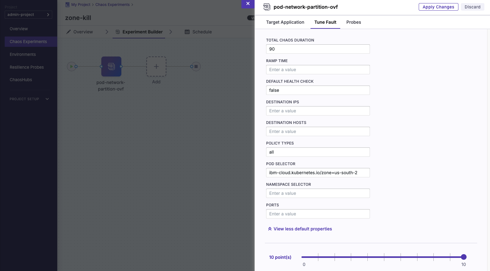
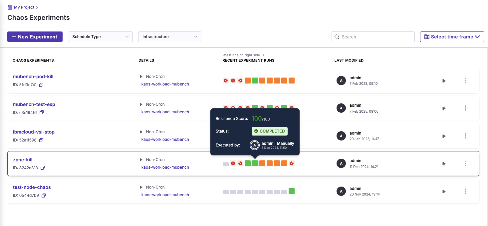

---

copyright:
   years: 2020, 2024
lastupdated: "2025-02-20"

keywords: chaos testing, resiliency, client testing

subcollection: resiliency

content-type: tutorial
account-plan: paid # Set `lite` if tutorial can be completed by using only Lite plan services; Set `paid` if the tutorial requires a pay-go or subscription versions of plans for the service
services: resiliency, containers
completion-time: 1h # Estimated time to complete the steps in this tutorial. Minute values are supported up to 90 minutes. Whole hours are also supported; for example: 2h

---

{{site.data.keyword.attribute-definition-list}}

# Running a zone failure chaos experiment
{: #tutorial-litmuschaos}
{: toc-content-type="tutorial"}
{: toc-services="resiliency, containers"}
{: toc-completion-time="1h"}

In this tutorial, you will learn how to set up LitmusChaos on a Red Hat OpenShift management cluster, configure a chaos experiment on a workload cluster to simulate an availability zone (AZ) outage, and observe the resiliency of an application running in such a situation. This application has multiple microservices, each running multiple replicas. The chaos fault will consist of the pods being partitioned from the network, therefore blocking ingress and egress traffic. The main aim of the tutorial is to show how to make an application resilient to such faults, along with providing a framework to conduct further chaos testing.

See the [chaos testing How To page](/docs/resiliency?topic=resiliency-chaos-testing#litmus-arch) for the recommended LitmusChaos reference architecture. Note also that it is not advised to run chaos testing in production environments, at least until you are completely confident in your testing capabilities. Otherwise, you run the risk of disabling critical production infrastructure. To start with, perform chaos testing in staging or pre-production environments.
{: shortdesc}

## Objectives
{: #litmus-chaos-objectives}

- Set up a management and workload cluster
- Install LitmusChaos on the management cluster
- Create an environment and chaos infrastructure in LitmusChaos
- Configure a workload application to run in multiple availability zones
- Create a chaos experiment that simulates an availability zone outage
- Run the chaos experiment and observe the results

## Before you begin
{: #tutorial-litmuschaos-prereqs}

This tutorial requires:

* [IBM Cloud CLI](https://cloud.ibm.com/docs/cli?topic=cli-getting-started)
* [oc](https://docs.openshift.com/container-platform/4.17/cli_reference/openshift_cli/getting-started-cli.html) for interacting with OpenShift
* [helm](https://helm.sh/docs/intro/install/) for installing LitmusChaos

## Set up a management and workload cluster
{: #tutorial-litmuschaos-cluster}
{: step}

First, you will need some Red Hat OpenShift or Kubernetes infrastructure, consisting of a management cluster and a workload cluster. The management cluster will contain the LitmusChaos control plane, and the workload cluster will host the application you wish to perform chaos testing on. If you already have suitable infrastructure, you may skip this step. In any case, for the purposes of this tutorial and experiment, you should provision the workload cluster to have at least two availability zones.

There is a choice here - you can select standard OpenShift, a [Secure Landing Zone (SLZ)](https://cloud.ibm.com/docs/secure-infrastructure-vpc?topic=secure-infrastructure-vpc-ocp-ra), or IBM Kubernetes Service. The SLZ will require some more configuration for LitmusChaos to function correctly, due to the extra security constraints. This section will explain how to install either option, and any further configurations required by the Secure Landing Zone will be flagged as such. See the VPC landing zone [deployment guide](https://cloud.ibm.com/docs/secure-infrastructure-vpc?topic=secure-infrastructure-vpc-overview#overview-ocp) for more information on the Landing Zone.

### Red Hat OpenShift (standard) or IBM Kubernetes Service
{: #rhos-vs-kub}

1. In the IBM Cloud catalog, go to the [Red Hat OpenShift on IBM Cloud](https://cloud.ibm.com/containers/cluster-management/catalog/create?platformType=openshift&catalog_query=aHR0cHM6Ly9jbG91ZC5pYm0uY29tL2NhdGFsb2c%2Fc2VhcmNoPW9wZW5zaGlmdCNzZWFyY2hfcmVzdWx0cw%3D%3D) page.
2. Select the desired cluster type between OpenShift and Kubernetes.
3. Fill in the desired details for a management cluster specification, and provision the cluster.
4. Repeat for a workload cluster. Remember that you should provision the cluster to run in at least two availability/worker zones.
5. Access the clusters from the [clusters](https://cloud.ibm.com/containers/cluster-management/clusters?platformType=openshift) page.

### Red Hat OpenShift (Secure Landing Zone)
{: #rhos-landing}

1. In the IBM Cloud catalog, go to the [Red Hat OpenShift Container Platform on VPC landing zone](https://cloud.ibm.com/catalog/architecture/deploy-arch-ibm-slz-ocp-95fccffc-ae3b-42df-b6d9-80be5914d852-global) page.
2. Select **Standard** as the cluster type - this is necessary as it is not recommended to run the chaos management plane on the same cluster as your workload.
3. Click on "Add to project" and fill in the details for a new or existing IBM Cloud project.
4. Configure the deployable architecture to your specifications. Aside from the required variables, this can be mostly left default if you wish. However, to achieve proper resilience, you should choose to deploy the worker nodes in at least two availability zones.
5. Validate, approve and deploy the secure landing zone infrastructure.
6. You will need to deploy a [client-to-site VPN](https://cloud.ibm.com/catalog/7a4d68b4-cf8b-40cd-a3d1-f49aff526eb3/architecture/deploy-arch-ibm-client-to-site-vpn-1b824983-263f-4191-bfcd-c1d1b2220aa3-global) to access both clusters.

{: caption="Chaos framework exemplary architecture showing LitmusChaos components" caption-side="bottom"}

### Networking
{: #networking-step}

Starting with version 4.15, all versions of OpenShift are secure by default. Therefore, for LitmusChaos to function correctly, the management and workload clusters must be able to communicate with each other. This can be achieved with a [transit gateway](/docs/transit-gateway?topic=transit-gateway-getting-started) if the clusters are in different VPCs. The SLZ DA contains configuration for transit gateways to be provisioned automatically.

Your workload application endpoint should be accessible at least to the management cluster, so that when chaos experiments run, probes can determine that status of your application.

Outbound access will be required for docker image pulls and Litmus ChaosHub integration over port 443.

If your clusters are in different VPCs, you will need to modify the security groups to allow for communication. Ensure that cluster [security groups](https://cloud.ibm.com/infrastructure/network/securityGroups) (identified by `kube-<cluster id>`) have outbound access, and that load balancer security groups (identified by `kube-lbaas-<cluster-id>`) have inbound access, from the relevant subnets each cluster is associated with.

For SLZ, a JSON file can be provided to the DA to override defaults including clusters, zones, and more. An example is provided [here](https://cloud.ibm.com/media/docs/downloads/resiliency/slz-override.json). Note that you will have to update resource prefixes to your own, along with values such as KeyProtect instance names.

Read the [network traffic guide](/docs/openshift?topic=openshift-vpc-security-group-reference) to understand more about OpenShift networking, security groups, and more.

## Install LitmusChaos ControlCenter
{: #tutorial-litmuschaos-install}
{: step}

1. Connect to the management cluster. See the[ cluster access instructions](/docs/containers?topic=containers-access_cluster) for more details.
2. Follow the LitmusChaos installation [instructions](https://docs.litmuschaos.io/docs/getting-started/installation) to install LitmusChaos. Follow the instructions for the **Self-hosted service**. It is also recommended to use the helm chart, as some changes may have to be made - these are detailed in the next steps.
3. Due to strict security rules in OpenShift, you will have to modify the helm chart so that pods run as a user with a UID between 1000710000 and 1000719999. For every `containers:` section, ensure that the following spec is included:

   ```
   securityContext:
      runAsUser: 1000700001
      allowPrivilegeEscalation: false
   ```
   Ensure that this is applied to all pods and deployments. For more information on security contexts and constraints, see the relevant OpenShift [page](/docs/openshift?topic=openshift-openshift_scc). In IBM Cloud, OpenShift by default runs under the `restricted-v2` SCC.
4. Ensure that you can access the control plane of LitmusChaos. The best practice for OpenShift is to use an [ingress](/docs/openshift?topic=openshift-ingress-about-roks4) with [TLS certificates](/docs/openshift?topic=openshift-secrets) that are stored within [Secrets Manager](/docs/openshift?topic=openshift-secrets-mgr).
5. Verify that the ChaosHub integration is correct. You can view this from the home page of the control plane. If it is configured incorrectly (typically, this will show the error message `error in syncing`), add the correct one - the URL should be https://github.com/litmuschaos/chaos-charts, and you should select the latest stable branch. For more information, see the [LitmusChaosHub](https://hub.litmuschaos.io/) marketplace.

## Create an environment and chaos infrastructure
{: #tutorial-litmuschaos-environment}
{: step}

1. Log into the LitmusChaos control center. If this is your first time logging in, you will be prompted to change the default password.
2. You can either use the default project, or create your own project by clicking on your username on the bottom left of the screen.
3. Add a remote environment by following the LitmusChaos [environment instructions](https://docs.litmuschaos.io/docs/user-guides/create-environment). Choose "pre-production" for the environment, as this tutorial is not designed for use in production environments.
4. Add a chaos infrastructure by following the LitmusChaos [infrastructure instructions](https://docs.litmuschaos.io/docs/user-guides/create-infrastructure). Choose "Namespace mode", as we don't want to give unnecessarily broad access to the cluster. The namespace should be the same namespace you intend to host the application on. This chaos experiment will only run against that namespace, so it is advised to remove the `litmus-admin` service account and replace it with one more restrictively scoped. Before running step 5 of the infrastructure instructions, consult the next step in this section of the tutorial.
5. As shown in the above instructions, download the resulting `.yml` file. If you are deploying to an SLZ cluster, you will need to modify the containers in the file. If running an SLZ, modify the `containers:` section to ensure that the following spec is included:

   ```
   securityContext:
      runAsUser: 1000700001
      allowPrivilegeEscalation: false
   ```

   The `runAsUser` UID parameter should always be within the range of 1000710000 and 1000719999, or that container will not run correctly on an SLZ.

   It can also be useful to review the RBAC (role-based access controls) in the experiment file, to ensure that unnecessarily broad access is not granted. Pay special attention to the permission verbs and what access is granted to the service account running the chaos experiment.
6. Deploy the yaml configuration file to your workload cluster. Once complete, your chaos infrastructure should be shown on the Chaos Infrastuctures page of your created environment. If it still displays "pending", there is an issue with your installation - verify that the instructions have been followed correctly, and check the logs of the "subscriber" pod in the application namespace for other issues. Otherwise, it should display as "connected".

## Configure a workload application to run in multiple AZs
{: #tutorial-litmuschaos-workload}
{: step}

If you already have a suitable application to test, you may use that with your chaos experiment. Otherwise, we recommend using a sample application such as [µBench](https://github.com/mSvcBench/muBench/tree/main). This sample should have at least one microservice, and be exposed through a route, so that a resilience probe can use that route to determine if the application is functioning correctly.

Remember from the previous steps that application pods will also need to run as a user with a UID between 1000710000 and 1000719999.

1. Configure your pods/deployments to apply [anti-affinity rules](https://docs.redhat.com/en/documentation/openshift_container_platform/4.13/html/nodes/controlling-pod-placement-onto-nodes-scheduling#nodes-scheduler-pod-affinity) for scheduling pod execution. You should target specific pods using labels. An example is below:

   ```
   affinity:
      podAntiAffinity:
         preferredDuringSchedulingIgnoredDuringExecution:
         -  weight: 100
            podAffinityTerm:
               labelSelector:
                  matchExpressions:
                  - key: app
                     operator: In
                     values:
                     - s0
                     - s1
                     - s2
                     - s3
               topologyKey: topology.kubernetes.io/zone
   ```

   Note that this example is targetting all microservices in [µBench](https://github.com/mSvcBench/muBench/tree/main). You may have to change the example to match the labels in your own appliction.

2. Apply the anti-affinity rules to the application under test. This will have the effect of placing pods

If you wish to test the validity of this chaos experiment, you can apply *affinity* rules instead of anti-affinity rules, to ensure all pods are scheduled on one node and therefore one zone - in this case, the chaos experiment should show that your application is not resilient.

## Create a monitoring probe
{: #tutorial-litmuschaos-probe}
{: step}

1. Click on "Resilience Probes" from the project page in LitmusChaos.
2. Select "+ New Probe".
3. For this experiment, it is advised to use a HTTP probe to monitor the applications endpoint, as this is the easiest to configure. Alternative probes are available, such as Prometheus metric checks and command-line based probes, if desired.
4. Give the probe a name, and configure the probe properties. The following defaults are a good starting point:

   | Property                 | Value |
   | ------------------------ | -----------  |
   | Timeout                  | 60s          |
   | Interval                 | 100ms        |
   | Attempt                  | 3            |
   | Polling Interval         | 100ms        |
   | Initial Delay (Optional) | N/A          |
   | Evaluation Timeout       | 600s         |
   {: caption="Probe defaults." caption-side="bottom"}

5. Click on "Probe Details", and configure the URL and HTTP method to match your application route. You can also include POST data, and match against a response code. For example, a probe checking port 200 with a criterion of "==" will only fail when the application fails to return a 200 code.
6. Save the probe.

{: caption="Default configuration for the resilience probe" caption-side="bottom"}

## Create a chaos experiment
{: #tutorial-litmuschaos-experiment}
{: step}

1. In the LitmusChaos Control Center, select your desired project and click on the "+ New Experiment" button.
2. Give the experiment a name, for example "chaos-az-pod-partition", and select the relevant chaos infrastructure to perform the experiment against.
3. Select "Blank Canvas" to build your experiment from scratch.
4. Click on "Add", and from the given ChaosHub, select **pod-network-partition** from the Kubernetes section.
5. For "Target Application", fill in the fields with relevant data. Ensure that your application deployment type matches your sample application. Select the correct namespace, and target the application by label using the dropdown. Ensure that your application labels are unique to application pods, or your chaos experiment may not target the correct pods.

{: caption="Targeting an application with labels" caption-side="bottom"}

6. In "Tune Fault", expand the default properties. In "Pod Selector", enter `ibm-cloud.kubernetes.io/zone=us-south-1`, swapping the zone for the zone you wish to simulate a fault for.

{: caption="Ensuring that only pods on worker nodes in a given availability zone are targeted" caption-side="bottom"}

7. In "Probes", select the probe created in Step 6. "Continous" mode should be used here.
8. Click on "Apply Changes" to save your experiment.

## Run the chaos experiment and observe the results
{: #tutorial-litmuschaos-run}
{: step}

1. The first thing you will need to do is ensure that all applications pods that are in scope of the chaos experiment should be labelled with the correct node topology. Unfortunately, this is not done by default in Kubernetes or OpenShift, so you have a choice here:
   - Label the pods manually. The label should be `ibm-cloud.kubernetes.io/zone=us-south-1`, once again swapping the cloud availability zone for the one you desire to simulate an outage on.
   - Use a policy-as-code framework such as [kyverno](https://kyverno.io/) to mutate your pod specifications to include the cloud availability zone as labels. Consult the [installation](https://kyverno.io/docs/installation/) documentation on how to install Kyverno. The specific policy to use is ["Add scheduled Node's labels to a Pod"](https://kyverno.io/policies/other/add-node-labels-pod/add-node-labels-pod/). You will need to modify the policy to apply IBM Cloud labels - the yaml for this is below.

   ```yaml
   apiVersion: kyverno.io/v2beta1
   kind: Policy
   metadata:
   name: add-node-labels-pod
   annotations:
      pod-policies.kyverno.io/autogen-controllers: none
      policies.kyverno.io/title: Add scheduled Node's labels to a Pod
      policies.kyverno.io/category: Other
      policies.kyverno.io/subject: Pod
      kyverno.io/kyverno-version: 1.10.0
      policies.kyverno.io/minversion: 1.10.0
      kyverno.io/kubernetes-version: "1.26"
      policies.kyverno.io/description: >-
         Containers running in Pods may sometimes need access to node-specific information on
         which the Pod has been scheduled. A common use case is node topology labels to ensure
         pods are spread across failure zones in racks or in the cloud. The mutate-pod-binding
         policy already does this for annotations, but it does not handle labels. A useful use
         case is for passing metric label information to ServiceMonitors and then into Prometheus.
         This policy watches for Pod binding events when the pod is scheduled and then
         asynchronously mutates the existing Pod to add the labels.
         This policy requires the following changes to common default configurations:
         - The kyverno resourceFilter should not filter Pod/binding resources.
         - The kyverno backgroundController service account requires Update permission on pods and get on nodes.
         It is recommended to use https://kubernetes.io/docs/reference/access-authn-authz/rbac/#aggregated-clusterroles
   spec:
   rules:
      - name: project-pod-topology-label
         match:
         any:
         - resources:
               kinds:
               - Pod/binding
         context:
         - name: node
         variable:
            jmesPath: request.object.target.name
            default: ''
         - name: zoneLabel
         apiCall:
            urlPath: "/api/v1/nodes/{{node}}"
            jmesPath: "metadata.labels.\"ibm-cloud.kubernetes.io/zone\" || 'empty'"
         - name: regionLabel
         apiCall:
            urlPath: "/api/v1/nodes/{{node}}"
            jmesPath: "metadata.labels.\"ibm-cloud.kubernetes.io/region\" || 'empty'"
         mutate:
         targets:
         - apiVersion: v1
            kind: Pod
            name: "{{ request.object.metadata.name }}"
            namespace: mubench
         patchStrategicMerge:
            metadata:
               labels:
               ibm-cloud.kubernetes.io/zone: "{{ zoneLabel }}"
               ibm-cloud.kubernetes.io/region: "{{ regionLabel }}"
   ```
2. From the Chaos Experiments page, you can run the resulting experiment by either clicking on the play button, or clicking into the experiment and selecting "Run".
3. The experiment will run. Along the way, you can follow the experiment progress through the UI. Once complete, a resilience score and status will be shown.

The final result is comprised of a resilience score and a status. The score will be 0 or 100 - other resilience scores are possible but only when multiple chaos experiments are run as a test suite.

| **Resilience Score** | **Status** | **Result**                             |
|----------------------|------------|----------------------------------------|
| 100                  | Complete   | Application is resilient               |
| 0                    | Complete   | Application is not resilient           |
| 0                    | Error      | Chaos experiment encountered a problem |
{: caption="Resilience score and a status." caption-side="bottom"}

If an error is encountered, check the chaos runner pods within the application namespace, along with the subscriber pod logs, for details.

If the experiment completed but the resilience score is 0, the application was not able to remain functional while the pods on an availability zone were partitioned from the network. This means that the replica pods were either all on the availability zone that was affected - due to either affinity rules stating they should be scheduled on the same zone, or because anti-affinity rules were not correctly configured.

{: caption="Chaos experiment result" caption-side="bottom"}


## Next steps
{: #chaos-litmus-next-steps}

You have successfully installed LitmusChaos, created an experiment, and run it against an application, showing that applications resiliency to a specific chaos experiment. Now you are ready to explore other types of chaos testing, such as [Container Kill](https://litmuschaos.github.io/litmus/experiments/categories/pods/container-kill/) or [Disk Fill](https://litmuschaos.github.io/litmus/experiments/categories/pods/disk-fill/#introduction). Apply these experiments in conjunction with the example from this tutorial to explore the true resiliency score of your application.
