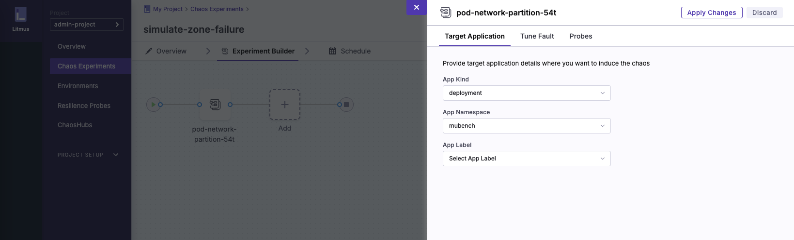

---

copyright:
   years: 2020, 2025
lastupdated: "2025-06-05"

keywords: chaos testing, resiliency, client testing

subcollection: resiliency
content-type: tutorial
account-plan: paid
services: resiliency, containers
completion-time: 1h

---

{{site.data.keyword.attribute-definition-list}}

# Running a zone failure chaos experiment
{: #tutorial-litmuschaos}
{: toc-content-type="tutorial"}
{: toc-services="resiliency, containers"}
{: toc-completion-time="1h"}

In this tutorial, you learn how to set up LitmusChaos on a Red Hat OpenShift management cluster, configure a chaos experiment on a workload cluster to simulate an availability zone (AZ) outage, and observe the resiliency of an application in an outage scenario. This application has multiple microservices, each running multiple replicas. The chaos fault consists of the pods that are partitioned from the network, which blocks ingress and egress traffic. The main aim of the tutorial is to show how to make an application resilient to such faults, along with providing a framework to conduct further chaos testing.
{: shortdesc}

LitmusChaos is a cloud-native, open source chaos engineering framework that is designed to help SREs and developers identify weaknesses and potential outages in their infrastructure and applications by inducing controlled chaos scenarios. For the LitmusChaos reference architecture, see the chaos testing [Architecture](/docs/resiliency?topic=resiliency-chaos-testing#litmus-arch). Avoid chaos testing in production environments, at least until you are confident in your testing capabilities. Otherwise, you run the risk of disabling critical production infrastructure. Begin by chaos testing in staging or pre-production environments.

## Before you begin
{: #tutorial-litmuschaos-prereqs}

This tutorial requires:

* [{{site.data.keyword.cloud_notm}} CLI](https://cloud.ibm.com/docs/cli?topic=cli-getting-started)
* [Red Hat OpenShift CLI](https://docs.openshift.com/container-platform/4.17/cli_reference/openshift_cli/getting-started-cli.html) for interacting with Red Hat OpenShift
* [Helm](https://helm.sh/docs/intro/install/) for installing LitmusChaos

## Set up a management and workload cluster
{: #tutorial-litmuschaos-cluster}
{: step}

Deploy a Red Hat OpenShift or Kubernetes infrastructure that consists of a management cluster and a workload cluster. The management cluster contains the LitmusChaos control plane, and the workload cluster hosts the application that is targeted for chaos testing. If you have an existing infrastructure, skip this step. Otherwise, provision the workload cluster to have at least two availability zones for redundancy.

In this tutorial, you focus on deploying the management and workload clusters within a [Secure Landing Zone (SLZ)](/docs/secure-infrastructure-vpc?topic=secure-infrastructure-vpc-ocp-ra), which requires extra configuration due to its enhanced security constraints. You can use either Red Hat OpenShift or Kubernetes for the management and workload clusters, depending on your infrastructure preferences. For more information on SLZ deployment, see the [deployment guide](/docs/secure-infrastructure-vpc?topic=secure-infrastructure-vpc-overview#overview-ocp).

1. In the {{site.data.keyword.cloud_notm}} catalog, go to the [Red Hat OpenShift Container Platform on VPC landing zone](/catalog/architecture/deploy-arch-ibm-slz-ocp-95fccffc-ae3b-42df-b6d9-80be5914d852-global) page.
1. Select **Standard** as the cluster type. This creates Red Hat OpenShift workload clusters on a secure VPC network, which is necessary since it's not recommended to run the chaos management plane on the same cluster as your workload.
1. Click **Add to project** and complete the details for a new or existing {{site.data.keyword.cloud_notm}} project.
1. Configure the deployable architecture to your specifications. Aside from the required variables, you can leave most of the configuration as it is by default.
1. Deploy the worker nodes in at least two availability zones by setting `cluster_zones` to 2 or 3 in the "Optional" tab to achieve proper resilience, or the chaos experiment doesn't function correctly.
1. Validate, approve, and deploy the secure landing zone infrastructure.
1. Deploy a [client-to-site VPN](/catalog/7a4d68b4-cf8b-40cd-a3d1-f49aff526eb3/architecture/deploy-arch-ibm-client-to-site-vpn-1b824983-263f-4191-bfcd-c1d1b2220aa3-global) to access both clusters.

{: caption="Chaos framework exemplary architecture showing LitmusChaos components" caption-side="bottom"}

### Networking
{: #networking-step}

Starting with version 4.15, all versions of Red Hat OpenShift are secure by default, meaning that network policies, security constraints, and inter-cluster communication settings are restricted by default. For LitmusChaos to function correctly, the management and workload clusters must be able to communicate with each other. This can be achieved with a [transit gateway](/docs/transit-gateway?topic=transit-gateway-getting-started) if the clusters are in different VPCs. The SLZ deployable architecture contains configuration for transit gateways to be provisioned automatically.

Make sure that your workload application endpoint is accessible to at least the management cluster so that when chaos experiments run, probes can determine that status of your application.

In this tutorial, your clusters are in different VPCs, so you need to modify the security groups to allow for communication between the management and workload clusters. Ensure that cluster security groups, which are identified by `kube-<cluster id>`, have outbound access, and that load balancer security groups, which are identified by `kube-lbaas-<cluster-id>`, have inbound access, from the subnets each cluster is associated with.
Outbound access is required for docker image pulls and Litmus ChaosHub integration over port 443. Review the following example of this configuration of outbound rules within the management security group.

If your clusters are in the same VPC, they can likely communicate without the previous stage. This depends on your network setup, but SLZ clusters are in separate VPCs.
{: note}

{: caption="Outbound rules for the management security group." caption-side="bottom"}

Complete the following steps for networking:

1. Go to the workload cluster to configure an outbound rule in the workload security group.
   1. Find the private IPs of the load balancer and add them, or a CIDR block that contains those IPs, as an outbound rule in the workload security group, communicating over port 443. This facilitates outbound access from the workload cluster to the management cluster's load balancer.
1. Go to the management cluster to configure an inbound rule in the management security group and allow inbound traffic over port 443.

    These inbound and outbound rules make the sample application available to the chaos probes in the management cluster.
    {: note}

1. (Optional) If you want your application to be exposed to the world, make sure that the destination for the outbound 443 rule is `0.0.0.0/0`.
1. Make sure that both the management and workload clusters have outbound internet access to pull container images for the sample application or your own, and the LitmusChaos images. These can be restricted to specific docker or quay IPs, or if acceptable, broad access over port 443 can be granted.

For SLZ, a JSON file can be provided to the deployable architecture to override defaults that include clusters, zones, and more. The [slz-override.json](https://cloud.ibm.com/media/docs/downloads/resiliency/slz-override.json) is an example. If you use an override, update resource prefixes to your own, along with values such as Key Protect instance names.

Read the [network traffic guide](/docs/openshift?topic=openshift-vpc-security-group-reference) to understand more about Red Hat OpenShift networking, security groups, and more.

## Install LitmusChaos ChaosCenter
{: #tutorial-litmuschaos-install}
{: step}

This step describes how to install and access the LitmusChaos ChaosCenter, a web-based portal that you use to create, deploy, and monitor chaos experiments.

1. Connect to the management cluster. For more information, see [Accessing clusters](/docs/containers?topic=containers-access_cluster).
2. Install LitmusChaos by following the [ChaosCenter installation instructions](https://docs.litmuschaos.io/docs/getting-started/installation) for the **Self-hosted service**. Use the helm chart, as you might have to make some changes detailed in the following steps.

   Take note of step 3 of **Install Litmus using Helm** in the instructions - for a nonlocal cluster, it is advised to use a ClusterIP, so exclude the `--set portal.frontend.service.type=NodePort` parameter.
   {: note}

3. Modify the helm chart so that pods run as a user with a UID between 1000710000 and 1000719999. For every `containers:` section, ensure that the following spec is included:

   ```yaml
   securityContext:
      runAsUser: 1000700001
      allowPrivilegeEscalation: false
   ```
   Ensure that the update in the helm chart is applied to all pods and deployments. For more information on security contexts and constraints, see the relevant Red Hat OpenShift [page](/docs/openshift?topic=openshift-openshift_scc). In {{site.data.keyword.cloud_notm}}, Red Hat OpenShift by default runs under the `restricted-v2` SCC.

4. Ensure that you can access the control plane of LitmusChaos. The best practice for Red Hat OpenShift is to use an [ingress](/docs/openshift?topic=openshift-ingress-about-roks4) with [TLS certificates](/docs/openshift?topic=openshift-secrets) that are stored within [Secrets Manager](/docs/openshift?topic=openshift-secrets-mgr). Review the following example ingress and update the placeholders for `host`, `namespace`, `hosts` and `secretName` to match your cluster configuration and secret names. In this configuration, TLS termination happens at the ingress level, which secures the LitmusChaos control plane and simplifies certificate management.

   ```yaml
      apiVersion: networking.k8s.io/v1
      kind: Ingress
      metadata:
      name: litmusportal-ingress
      namespace: <placeholder-namespace>
      spec:
      rules:
      - host: <placeholder-host>
         http:
            paths:
            - backend:
               service:
                  name: litmusportal-auth-server-service
                  port:
                  number: 9005
            path: /auth/
            pathType: Prefix
            - backend:
               service:
                  name: litmusportal-server-service
                  port:
                  number: 9004
            path: /api/
            pathType: Prefix
            - backend:
               service:
                  name: litmusportal-frontend-service
                  port:
                  number: 9091
            path: /
            pathType: Prefix
      tls:
      - hosts:
         - <placeholder-host>
         secretName: <placeholder-secret-name>
   ```
{: codeblock}

5. Verify that the ChaosHub integration is correct by going to the home page of the control plane. If it is configured incorrectly, you might see the error message `error in syncing`. Add the correct URL: https://github.com/litmuschaos/chaos-charts and you select the latest stable branch. For more information, see the [LitmusChaosHub](https://hub.litmuschaos.io/) marketplace.

## Create an environment and chaos infrastructure
{: #tutorial-litmuschaos-environment}
{: step}

This step explains how to set up chaos infrastructure, which is a service that is deployed in your workload cluster to inject chaos as requested by the control plane that you created in the previous step.

1. Log in to the LitmusChaos control plane UI. The URL for this, with a default configuration, is located in the Routes section of your management cluster, and typically has a prefix of `litmus-frontend-ingress`. If this is the first time you log in, you are prompted to change the default password. The default credentials are on the [installation page](https://docs.litmuschaos.io/docs/getting-started/installation).
2. Use the default project or create your own project by clicking your username (or Admin), selecting "Projects" and then create a project by clicking "+ Create Project".
3. Add a remote environment by following the LitmusChaos [environment instructions](https://docs.litmuschaos.io/docs/user-guides/create-environment). Choose "pre-production" for the environment, as this tutorial is not designed for use in production environments.
4. Add a chaos infrastructure by following the LitmusChaos [infrastructure instructions](https://docs.litmuschaos.io/docs/user-guides/create-infrastructure). Choose "Namespace mode" to avoid giving broad access to the cluster. Use the same namespace that you intend to host the application on. This chaos experiment runs only against that namespace, so remove the `litmus-admin` service account and replace it with one with a more restrictive scope.
5. Download the resulting `.yml` file. If you are deploying to an SLZ cluster, modify the `containers:` section in the file to ensure that the following spec is included:

   ```yaml
   securityContext:
      runAsUser: 1000700001
      allowPrivilegeEscalation: false
   ```
{: codeblock}

   Make sure that the `runAsUser` UID parameter is within the range of 1000710000 and 1000719999, or that container doesn't run correctly on an SLZ.

   It can also be useful to review the RBAC (role-based access controls) in the experiment file to ensure that broad access is not granted. Pay special attention to the permission verbs and what access is granted to the service account that runs the chaos experiment.

6. Deploy the yaml configuration file to your workload cluster by clocking the "+" icon from your cluster UI, or through the `oc` or `kubectl` CLI. The CLI requires you to log in to the cluster. To do so, click your username from the cluster UI, and click "copy login command". Once complete, your chaos infrastructure is shown on the Chaos Infrastructure page of your created environment. If it still displays "pending", you might have an issue with your installation. Verify that you followed the instructions correctly, and check the logs of the "subscriber" pod in the application namespace for other issues. Otherwise, it displays as "connected".

## Configure a workload application to run in multiple AZs
{: #tutorial-litmuschaos-workload}
{: step}

In this section, you deploy a sample application, or use your own, and modify it so that it is suitable for a chaos experiment that simulates an availability zone failure.

If you already have a suitable application to test, use that with your chaos experiment. Otherwise, use a sample application, like [µBench](https://github.com/mSvcBench/muBench/tree/main). This sample has at least one microservice and is exposed through a route so that a resilience probe can use that route to determine whether the application is functioning correctly.

Remember from the previous steps that application pods also need to run as a user with a UID between 1000710000 and 1000719999.

1. Configure your pods to apply [anti-affinity rules](https://docs.redhat.com/en/documentation/openshift_container_platform/4.13/html/nodes/controlling-pod-placement-onto-nodes-scheduling#nodes-scheduler-pod-affinity) for scheduling pod execution. Target specific pods by using labels. Review the following example:

   ```yaml
   affinity:
      podAntiAffinity:
         preferredDuringSchedulingIgnoredDuringExecution:
         -  weight: 100
            podAffinityTerm:
               labelSelector:
                  matchExpressions:
                  - key: app
                     operator: In
                     values:
                     - s0
                     - s1
                     - s2
                     - s3
               topologyKey: topology.kubernetes.io/zone
   ```
{: codeblock}

   This example is targeting all microservices in [µBench](https://github.com/mSvcBench/muBench/tree/main). You might have to change the example to match the labels in your own application.

2. Apply the anti-affinity rules to the application under test, which places pods.

If you want to test the validity of this chaos experiment, you can apply *affinity* rules instead of anti-affinity rules, to ensure that all pods are scheduled on one node and therefore one zone. In this case, the chaos experiment shows that your application is not resilient.

## Create a monitoring probe
{: #tutorial-litmuschaos-probe}
{: step}

This step explains how to create a probe that monitors the health of your application while a chaos experiment is run against it.

1. From the project page in LitmusChaos, click "Resilience Probes".
2. Select "+ New Probe".
3. For this experiment, use an HTTP probe to monitor the applications endpoint since it is the simpler to configure. Alternative probes are available, such as Prometheus metric checks and command-line based probes.
4. Give the probe a name, and configure the probe properties. The following defaults are a good starting point:

   | Property                 | Value |
   | ------------------------ | -----------  |
   | Timeout                  | 60 s          |
   | Interval                 | 100 ms        |
   | Attempt                  | 3            |
   | Polling Interval         | 100 ms        |
   | Initial Delay (Optional) | N/A          |
   | Evaluation timeout       | 600 s         |
   {: caption="Probe defaults." caption-side="bottom"}

5. Click "Probe Details", and configure the URL and HTTP method to match your application route. You can also include POST data, and match against a response code. For example, a probe checking port 200 with a criterion of "==" fails only when the application fails to return a 200 code.
6. Save the probe.


## Create a chaos experiment
{: #tutorial-litmuschaos-experiment}
{: step}

In this step, you learn how to create a chaos experiment that simulates an availability zone failure in your application namespace.

1. In the LitmusChaos Control Center, select your project and click the "+ New Experiment" button.
2. Give the experiment a name, for example "chaos-az-pod-partition", and select the relevant chaos infrastructure to perform the experiment against.
3. Select "Blank Canvas" to build your experiment from scratch.
4. Click "Add". From your ChaosHub, select **pod-network-partition** from the Kubernetes section.
5. For "Target Application", complete the fields with relevant data. Ensure that your application deployment type matches your sample application, and select the correct namespace. Leave "App Label" blank for now.
6. Leave "Tune Fault" blank. You modify this section in the YAML editor later.
7. In "Probes", select the probe that is created in Step 6. Use "Continuous" mode.
8. Click "Apply Changes" to save your experiment.
9. Next, due to limitations in the LitmusChaos UI regarding applications with multiple pod types, you need to modify the experiment you created by using the YAML editor. Click the "VISUAL/YAML" slider in the experiment to change to the YAML editor.
10. Search for "appinfo" in the YAML. In "applabel", add the {{site.data.keyword.cloud_notm}} zone that you want to disable for the experiment. Review the following example "appinfo" code block:

   ```yaml
   appinfo:
      appns: mubench
      applabel: ibm-cloud.kubernetes.io/zone=us-south-3
      appkind: deployment
   ```
{: codeblock}

11. Save the chaos experiment.

{: caption="Providing target application details where you want to introduce the chaos." caption-side="bottom"}

## Run the chaos experiment and observe the results
{: #tutorial-litmuschaos-run}
{: step}

This step describes how you run the chaos experiment, monitor the application health, and understand the results of the experiment.

1. Make sure that all applications pods that are in the scope of the chaos experiment are labeled with the correct node topology. This is not done by default in Kubernetes or Red Hat OpenShift, so you have a choice here:
   - Label the pods manually. Use the label `ibm-cloud.kubernetes.io/zone=us-south-1` to again swap the cloud availability zone for the one you want to simulate an outage on.
   - Use a policy-as-code framework such as [kyverno](https://kyverno.io/) to mutate your pod specifications to include the cloud availability zone as labels. Consult the [installation](https://kyverno.io/docs/installation/) documentation on how to install Kyverno. The specific policy to use is ["Add scheduled Node's labels to a Pod"](https://kyverno.io/policies/other/add-node-labels-pod/add-node-labels-pod/). Modify the policy to apply {{site.data.keyword.cloud_notm}} labels as shown in the following example.

   ```yaml
   apiVersion: kyverno.io/v2beta1
   kind: Policy
   metadata:
   name: add-node-labels-pod
   annotations:
      pod-policies.kyverno.io/autogen-controllers: none
      policies.kyverno.io/title: Add scheduled Node's labels to a Pod
      policies.kyverno.io/category: Other
      policies.kyverno.io/subject: Pod
      kyverno.io/kyverno-version: 1.10.0
      policies.kyverno.io/minversion: 1.10.0
      kyverno.io/kubernetes-version: "1.26"
      policies.kyverno.io/description: >-
         Containers running in Pods may sometimes need access to node-specific information on
         which the Pod has been scheduled. A common use case is node topology labels to ensure
         pods are spread across failure zones in racks or in the cloud. The mutate-pod-binding
         policy already does this for annotations, but it does not handle labels. A useful use
         case is for passing metric label information to ServiceMonitors and then into Prometheus.
         This policy watches for Pod binding events when the pod is scheduled and then
         asynchronously mutates the existing Pod to add the labels.
         This policy requires the following changes to common default configurations:
         - The kyverno resourceFilter should not filter Pod/binding resources.
         - The kyverno backgroundController service account requires Update permission on pods.
         It is recommended to use https://kubernetes.io/docs/reference/access-authn-authz/rbac/#aggregated-clusterroles
   spec:
   rules:
      - name: project-pod-topology-label
         match:
         any:
         - resources:
               kinds:
               - Pod/binding
               names:
               - "s0-*"
         context:
         - name: node
         variable:
            jmesPath: request.object.target.name
            default: ''
         - name: zoneLabel
         apiCall:
            urlPath: "/api/v1/nodes/{{node}}"
            jmesPath: "metadata.labels.\"ibm-cloud.kubernetes.io/zone\" || 'empty'"
         - name: regionLabel
         apiCall:
            urlPath: "/api/v1/nodes/{{node}}"
            jmesPath: "metadata.labels.\"ibm-cloud.kubernetes.io/region\" || 'empty'"
         mutate:
         targets:
         - apiVersion: v1
            kind: Pod
            name: "{{ request.object.metadata.name }}"
            namespace: mubench
         patchStrategicMerge:
            metadata:
               labels:
                ibm-cloud.kubernetes.io/zone: "{{ zoneLabel }}"
                ibm-cloud.kubernetes.io/region: "{{ regionLabel }}"
   ```
{: codeblock}

   In this kyverno example, the application targets any pods that begin with `s0-*`. This is because in certain network configurations, if no specific application is targeted along with the zone label, it might result in all pods in the namespace being affected. Henceforth, this results in only the targeted application being labeled with an availability zone.
   {: note}

2. From the Chaos Experiments page, you can run the resulting experiment by either clicking the play button, or clicking into the experiment and selecting "Run".
3. As the experiment runs, you can follow the experiment progress through the UI. Once complete, a resilience score and status is shown.

The final result is composed of a resilience score and a status. The score is 0 or 100. Other resilience scores are possible only when multiple chaos experiments are run as a test suite.

| **Resilience Score** | **Status** | **Result**                             |
|----------------------|------------|----------------------------------------|
| 100                  | Complete   | Application is resilient               |
| 0                    | Complete   | Application is not resilient           |
| 0                    | Error      | Chaos experiment encountered a problem |
{: caption="Resilience score and a status." caption-side="bottom"}

If an error occurs, check the chaos runner pods within the application namespace, along with the subscriber pod logs, for details.

If the experiment is complete but the resilience score is 0, the application was not able to remain functional while the pods on an availability zone were partitioned from the network. This means that the replica pods were either all on the availability zone that was affected - due to either affinity rules stating they should be scheduled on the same zone, or because anti-affinity rules were not correctly configured.

{: caption="Chaos experiment result" caption-side="bottom"}


## Next steps
{: #chaos-litmus-next-steps}

You have successfully installed LitmusChaos, created an experiment, and run it against an application, showing that applications resiliency to a specific chaos experiment. Now, you are ready to explore other types of chaos testing, such as [Container Kill](https://litmuschaos.github.io/litmus/experiments/categories/pods/container-kill/) or [Disk Fill](https://litmuschaos.github.io/litmus/experiments/categories/pods/disk-fill/#introduction). Apply these experiments along with the example from this tutorial to explore the true resiliency score of your application.
