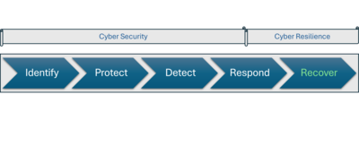

---

copyright:
  years: 2024
lastupdated: "2024-11-13"

keywords: cyber resiliency overview, resilient app, cyber recovery

subcollection: resiliency

---

{{site.data.keyword.attribute-definition-list}}

# Understanding cyber resiliency
{: #cyber-resiliency-overview}

Cyber resilience is part of an organization's capability to prevent, withstand and recover from cybersecurity incidents, including ransomware attacks and other malicious actions. 

{: caption="Diagram depicting scope of cyber security vs cyber resiliency" caption-side="bottom"}

Protection against such threats should be a 2-pronged approach: cyber security focusses on preventing the attacks in the first place, while cyber resiliency focuses on prevailing in the event of a cyber breach. In an environment where threats and threat actors are continuously evolving, adopting a secure-by-design approach is essential to prepare for the inevitability of an attack. Business continuity planning in these scenarios should prioritize the safe and secure restoration of critical applications and infrastructure to maintain operational stability. 

{{site.data.keyword.cloud_notm}} could host both your production and recovery environments or the recovery environment for an on-prem or remote production environment or be a secure data vault to securely store and verify your backup copies of golden images, configuration and data for recovery. 

## What's the difference between cyber resiliency and disaster recovery?
{: #cyber-dr-difference}

While both cyber resiliency and disaster recovery deal with recovering from backups, their goals differ significantly and this drives different requirements, processes, tools and techniques needed. It is beneficial to consider cyber resiliency as the third and distinct pillar from backup and disaster recovery of your operational resiliency. Some of the significant differences are

* Nature: Unlike disasters, which are typically random natural events, cyberattacks are targeted, well-planned, and engineered for maximum impact.
* [Recovery Point Objective](#x3429911){: term} (RPO) considerations: While disaster recovery aims at reducing RPO and returning services with minimum data loss, some effects of cyberattacks might be latent, and so the recovery point is not always known. The goal is to restore to a clean state even if it would mean a greater RPO and data loss.
* Backup copies: Ransomware attacks are known to target backup copies, either destroying or corrupting them. Unlike disaster recovery, the latest backup copy might be inappropriate for cyber recovery. Multiple backups are maintained and a typical 3-2-1 rule of backups is extended to 3-2-1-1-0, for example, 3 copies of data of which 2 are stored in separate media with 1 in a different location and 1 offline, and at least a copy with 0 errors. The offline copy helps ensure a physical air-gap and having at least 1 valid recovery point helps ensure that we can successfully recover to it.
* Isolation: A valid recovery point means that we periodically restore and test backups for recoverability in a clean and isolated environment to help ensure that any malicious code does not affect the rest of the environment. Forensic analysis to analyze the extent of the attack and the threat vector itself might need a separate isolated environment.

For more information, see [cyber recovery versus disaster recovery: What’s the difference?](https://www.ibm.com/think/topics/cyber-recovery-vs-disaster-recovery){: external}.
