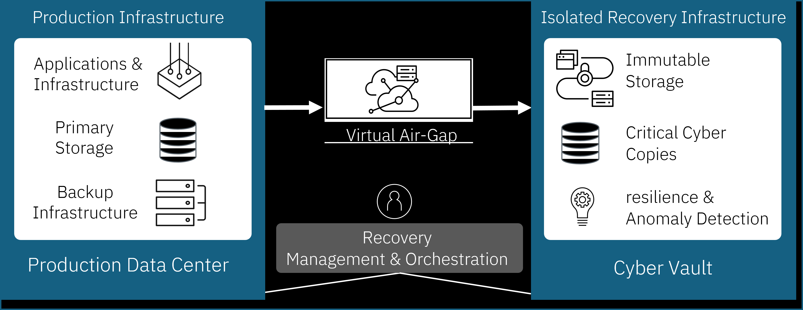

---

copyright:
  years: 2021, 2024
lastupdated: "2024-11-15"

keywords: cyber resiliency plan, resilient app, cyber recovery

subcollection: resiliency

---

{{site.data.keyword.attribute-definition-list}}

# Designing for cyber resiliency
{: #cyber-resiliency-plan}

A cyber-resiliency strategy uses a risk-based approach to align organizational objectives with achievable goals. It begins by identifying critical assets and their dependencies, for instance, a Minimum Viable Company (MVC) concept defines a functional level of service which can continue to serve customers during disruptions. Not all applications will require the same level of protection, so it’s essential to balance the risk factors with the additional cost and complexity involved. For workloads deployed on {{site.data.keyword.cloud_notm}}, this inventory includes application images, configurations, data, and the dependent cloud services and infrastructure required to operate them at the necessary scale. 

Before we delve deeper, we need to clarify the scope of the attack and recovery which is inherent to a cloud. For customer workloads deployed on {{site.data.keyword.cloud_notm}}, there is a clear boundary between customer account and resources provisioned within and the common {{site.data.keyword.cloud_notm}} fabric and underlying resources that support all customer resources. This boundary is enforced by strict multi-layered security measures such as separation of concern, access control, network isolation etc. In case of a cyber incident affecting {{site.data.keyword.cloud_notm}} fabric itself, {{site.data.keyword.cloud_notm}} will excercise its cyber recovery plan and restore its services first before notifying and working with affected customers to perform recovery of their resources. This document provides guidance for the case wherein a cyber incident affects only the customer account and resources provisioned within while the underlying {{site.data.keyword.cloud_notm}} fabric is unaffected. You should familiarise yourself with the [shared responsibilities](/docs/overview?topic=overview-shared-responsibilities) between {{site.data.keyword.cloud_notm}} and customers for running workloads on {{site.data.keyword.cloud_notm}}. 

## Data Consistency
{: #data-consistency}

An important consideration to address as you identify critical applications is how the data backup and recovery needs to be performed. The type of data backup you take will affect whether further steps are needed post restoration. A consistent backup of live data typically means that a copy of the data can be captured without the need for stopping the application writing to it. Modern systems offer different types of backups including crash-consistent and application-consistent backup

* Crash-consistent - Records all the data written to persistent store but not those in memory or pending I/O. Such types of backups are fast as no special application quiescing or memory flush operation is needed, but applications should be able to recover from a crash-consistent backup. For instance, many databases use a special log-based recovery approach to recover the database to a consistent state. A copy of transaction logs and data volumes is sufficient to bring the database back to consistent state.

* Application-consistent - An application aware backup, quiesces the application stopping it from processing any updates and flushes any dirty data in memory and pending I/O queues to persistent store before capturing the backup. This is typically done through hooks into the application or as pre and post scripts run on servers. During recovery, since the backup is already consistent, the application does not need to do any additional processing making recovery faster and reliable.

## Architectural Concepts
{: #architectural-concepts}

{: caption="Diagram depicting cyber resiliency architectural components" caption-side="bottom"}

The critical workloads running in the production environment should be securely backed up into a cyber vault. The backup copies in the cyber vault then becomes a trusted source from which recovery can be orchestrated later. Some of the main architectural aspects of a effective cyber resiliency solution are: 

* Isolation - Multiple environments, each setup for a specific purpose and isolated both in terms of network and administrative boundaries ensure that there is clear separation of concern and any malicious actor or code does not laterally gain access to systems. {{site.data.keyword.cloud_notm}} Virtual Private Cloud (VPC) enable highly secure private cloud environments powered by robust software defined network (SDN), built-in security and regulatory compliance standards.
* Virtual Air-Gap - Air-gapping ensures that no malicious actors or code can gain access to criticial systems like the cyber vault and the backup data within it. A virtual air-gap is typically enforced using network rules which allow only trusted traffic to go through and deny all others. In addition, the air-gap may be closed or opened only at scheduled periods. It can be implemented using a firewall appliance or by leveraging built-in capabilities like the {{site.data.keyword.cloud_notm}} VPC network access control lists and security groups.
* Immutable Storage - Backups written to immutable storage and retained for a configurable period of time, provide a technical assurance that even with elevated privileges, a bad actor cannot cause data corruption. For instance, {{site.data.keyword.cloud_notm}} cloud object storage's [immutable storage](/docs/cloud-object-storage?topic=cloud-object-storage-immutable) feature preserves records and maintains data integrity in a write-once-read-many (WORM), non-erasable and non-rewritable manner until end of retention period and the removal of any legal holds.
* Cleanroom - Data backups are only useful if you can recover to a stable state from them. A recovery point could be a collection of individual backups of different components which when restored can bring an application to consistent state. A cleanroom is an isolated environment where recovery points can be verified and even potentially cleaned off malware, either by restoring them or using forensic tools. Cleanroom environments can be torn-down after testing and re-provisioned as a clean infrastructure state to test upon.
* Recovery Environment - In the event of a cyber incident when production services are down, the recovery environment is bulit to host the criticial applications restored to a valid recovery point and takeover the job of production. The recovery environment could be in the same region as old production or in a different region. Over time, a recovery environment could be promoted as new production or could cease to exist if another environment takesover as production.

The [cyber resiliency pattern on VPC](/docs/pattern-cyber-resiliency-vpc?topic=pattern-cyber-resiliency-vpc-cyber-resiliency) provides an approach to build a cyber resiliency solution on top of a secure VPC environment.

## Automation and Orchestration
{: #orchestration}

Rapid service restoration requires a well-orchestrated, end-to-end recovery process. Automating distinct steps such as provisioning secure environments, periodically testing backups for new vulnerabilities, and restoring data into a recovery environment as workflows can streamline this process. Routinely testing orchestration tools and processes strengthens confidence in an organization's preparedness to respond effectively to incidents.

{{site.data.keyword.cloud_notm}} [Deployable Architectures](/docs/secure-enterprise?topic=secure-enterprise-understand-module-da) is cloud automation for deploying pre-created architectural patterns and is designed to be repeatable, scalable and modular. [Projects](/docs/secure-enterprise?topic=secure-enterprise-config-project) can help organize and manage the deployment configurations by ensuring commit checks, vulnerability scans and cost estimation. After your infrastructure is deployed, your [DevSecOps toolchains](/docs/devsecops-alm?topic=devsecops-alm-devsecops-alm-overview) can be configured, which then deploy your applications using continous deployment pipelines.
