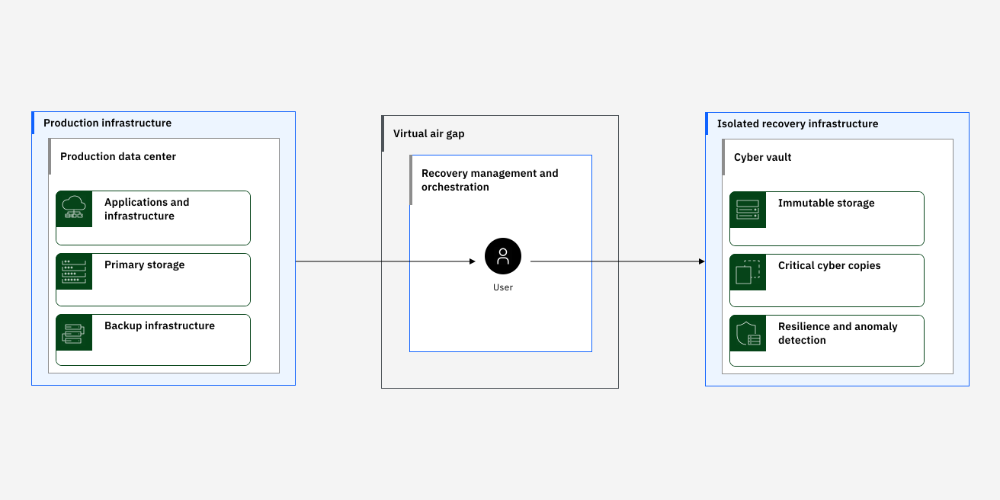

---

copyright:
  years: 2021, 2024
lastupdated: "2024-12-11"

keywords: cyber resiliency plan, resilient app, cyber recovery

subcollection: resiliency

---

{{site.data.keyword.attribute-definition-list}}

# Designing for cyber resiliency
{: #cyber-resiliency-plan}

A cyber resiliency strategy uses a risk-based approach to align organizational objectives with achievable goals. It begins by identifying critical assets and their dependencies. For instance, a Minimum Viable Company (MVC) concept defines the most basic or core set of services that are required to continue to serve their customers during disruptions. Not all applications require the same protection, balance the risk factors with the additional cost and complexity involved. For workloads that are deployed on {{site.data.keyword.cloud_notm}}, inventory includes application images, configurations, data, and the dependent cloud services and infrastructure that are required to operate at the necessary scale.
{: shortdesc}

Consider the scope of the attack and recovery that is inherent to a cloud environment. For workloads that are deployed on {{site.data.keyword.cloud_notm}}, a clear boundary exists between client account resources and the underlying {{site.data.keyword.cloud_notm}} resources that support all {{site.data.keyword.IBM_notm}} clients. Strict multilayered security measures, such as separation of concern, access control, and network isolation, enforce this boundary. If a cyber incident that affects the {{site.data.keyword.cloud_notm}} itself occurs, {{site.data.keyword.cloud_notm}} restores its services first as part of exercising its cyber recovery plan. Then, {{site.data.keyword.cloud_notm}} works with affected clients to recover their resources.

Review the following guidance for handling cyber incidents that impact only the client account and its resources, while the underlying {{site.data.keyword.cloud_notm}} infrastructure remains unaffected. Learn about the [shared responsibilities](/docs/overview?topic=overview-shared-responsibilities) between {{site.data.keyword.cloud_notm}} and clients that run workloads on {{site.data.keyword.cloud_notm}}.

## Data consistency
{: #data-consistency}

As you identify critical applications, consider how their data can be backed up and recovered. The type of data backup you take influences whether further steps are needed post restoration. A consistent backup of live data typically means that a copy of the data can be captured without the need for stopping the application writing to it. Modern systems offer different types of backups that include the following ones.

Crash-consistent
:   Records all the data that is written to a persistent store but not those in memory or pending I/O. Such types of backups are fast as no special application quiescing or memory flush operation is needed, but applications should be able to recover from a crash-consistent backup. For instance, many databases use a special log-based recovery approach to recover the database to a consistent state. A copy of transaction logs and data volumes is sufficient to bring the database back to a consistent state.

Application-consistent
:   An application-aware backup quiesces the application, stopping it from processing any requests and flushes any dirty data in memory and pending I/O queues to persistent store before capturing the backup. This is typically done through hooks into the application or as pre and post-scripts that are run on servers. During recovery, since the backup is already consistent, the application does not need to do any additional processing, which can make recovery faster and more reliable.

## Architectural concepts
{: #architectural-concepts}

{: caption="Diagram depicting cyber resiliency architectural components" caption-side="bottom"}

Securely back up critical workloads that run in a production environment in a cyber vault. The backup copies in the vault then become a trusted source from which recovery can be orchestrated if needed. Some of the main architectural aspects of an effective cyber resiliency solution are as follows.

Isolation
:   Multiple environments are set up for specific purposes and isolated by network and administrative boundaries. This helps ensure clear separation of concerns and prevents malicious actors or code from gaining lateral access to systems. {{site.data.keyword.vpc_full}}(VPC) helps enable highly secure private cloud environments that are powered by a robust software-defined network (SDN), built-in security, and regulatory compliance standards.

Virtual air-gap
:   Air-gapping ensures that no malicious actors or code can gain access to critical systems like the cyber vault and the backup data within it. A virtual air-gap is typically enforced by using network rules which allow only trusted traffic to go through and deny all others. In addition, the air-gap might be opened or closed only at scheduled periods. It can be implemented by using a firewall appliance or by using built-in capabilities like the {{site.data.keyword.cloud_notm}} VPC network access control lists and security groups.

Immutable storage
:   Backups that are written to immutable storage and retained for a configurable period, provide a technical assurance that even with elevated privileges, a bad actor cannot cause data corruption. For example, the {{site.data.keyword.cos_full_notm}} [immutable storage](/docs/cloud-object-storage?topic=cloud-object-storage-immutable) feature preserves records and maintains data integrity in a write-once-read-many (WORM), nonerasable and nonrewritable manner until the end of retention period and the removal of any legal holds.

Cleanroom
:   Data backups are only useful if you can recover to a stable state from them. A recovery point might be a collection of individual backups of different components which when restored can bring an application to a consistent state. A cleanroom is an isolated environment where recovery points can be verified and cleaned off malware, either by restoring them or using forensic tools. Cleanroom environments can be torn down after testing and re-created as a clean infrastructure state to test upon.

Recovery environment
:   If a cyber incident occurs when production services are down, the recovery environment is built to host the critical applications that are restored to a valid recovery point and takeover the job of production. The recovery environment might be in the same region as old production or in a different region. Over time, a recovery environment might be promoted as new production or might cease to exist if another environment takes over as production.

The [cyber resiliency pattern on VPC](/docs/pattern-cyber-resiliency-vpc?topic=pattern-cyber-resiliency-vpc-cyber-resiliency) provides an approach to build a cyber resiliency solution on top of a secure VPC environment.

## Automation and orchestration
{: #orchestration}

Rapid service restoration requires a well-orchestrated, end-to-end recovery process. Automating distinct steps such as provisioning secure environments, periodically testing backups for new vulnerabilities, and restoring data into a recovery environment as workflows can streamline this process. Routinely testing orchestration tools and processes strengthens confidence in an organization's preparedness to respond effectively to incidents.

{{site.data.keyword.cloud_notm}} [Deployable Architectures](/docs/secure-enterprise?topic=secure-enterprise-understand-module-da) provides cloud automation for deploying pre-created architectural patterns and is repeatable, scalable, and modular. [Projects](/docs/secure-enterprise?topic=secure-enterprise-config-project) can help organize and manage the deployment configurations by ensuring commit checks, vulnerability scans, and cost estimation. After your infrastructure is deployed, your [DevSecOps toolchains](/docs/devsecops-alm?topic=devsecops-alm-devsecops-alm-overview) can be configured to deploy your applications by using continuous deployment pipelines.
