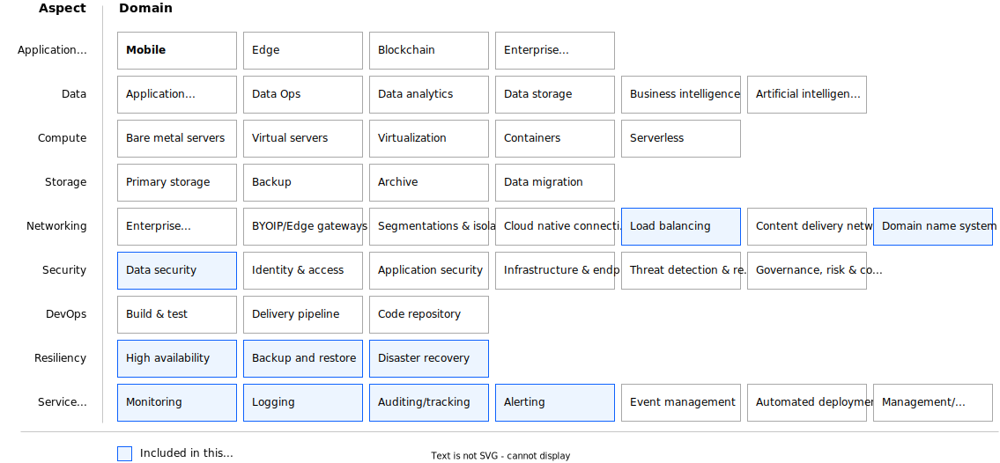

---

copyright:
  years: 2024, 2024
lastupdated: "2024-11-13"

keywords: high availability, regions, zones, resiliency

subcollection: ha-infrastructure

---

# High availability design for applications
{: #high-availability-design}

{{site.data.keyword.cloud_notm}} supports [high availability](#x2284708){: term} application deployments in a single zone, across multiple zones in a multi-zone region, and across multiple regions.

Failure domains determine the level of protection from infrastructure failures for each HA deployment option. Application instances that are deployed in multiple availability zones are within a metro area that is connected over a low latency network and data can be replicated synchronously across the zones. Application instances that are deployed in multiple regions are typically in different geos that are connected over a WAN and data can be replicated asynchronously across the regions. The following table shows application deployment options based on failure domains available in a public cloud.

| HA deployment model           | Availability | Failure domain                | Cost and complexity |
|-------------------------------|--------------|-------------------------------|---------------------|
| Single-zone, \n single-region | Low/Med      | Virtual Server / Physical Host| Low                 |
| Multi-zone, \n single-region  | High         | Zone                          | Medium              |
| Multi-zone, \n multi-region   | Very high    | Region                        | High                |
{: caption="High availability deployment options and their respective availability, failure domain, and cost and complexity to maintain." caption-side="bottom"}

## Single-zone deployment
{: #single-zone}

In single-zone deployments, multiple compute instances are deployed in one zone by using [Placement Groups](/docs/vpc?topic=vpc-about-placement-groups-for-vpc) to provision virtual servers in separate physical hosts and [VPC Autoscale](/docs/vpc?topic=vpc-creating-auto-scale-instance-group) to enable dynamic adjustment of capacity based on load changes. Single zone deployment provides cost-effective solutions with 99.9% infrastructure availability that might be appropriate for nonproduction environments or nonbusiness critical applications. However, single-zone deployments provide no protection from zone outages.

## Multi-zone, single-region deployment
{: #multi-zone-single-region}

In a multi-zone, single-region deployment, multiple compute instances are deployed across two or more availability zones within a region. Multi-zone, single region deployment can provide up to 99.99% infrastructure availability, when the application is deployed across 3 availability zones. This deployment protects the application from zone failures and is suitable for production-level enterprise workloads with \>99.9% availability requirements. Actual application availability depends on the application high availability design.

## Multi-zone, multi-region deployment
{: #multi-zone-multi-region}

A multi-zone, multi-region deployment provides protection against region outages. This is the recommended deployment for mission-critical applications with continuous or near continuous availability requirements. This deployment also supports out of region disaster recovery and business continuity policies with cross geo or distance requirements.

Multi-zone deployments rely on application-aware data replication across availability zones and support active-active and active-standby architecture patterns. Multi-zone, multi-region deployments support architecture patterns for enterprise applications with continuous availability/always on requirements. The following tables show a comparison of the different deployment options and recommended use.

| Deployment    | Availability | Description   | Recommended use   |
|------------------|------------------|------------------|------------------|
| Single-zone                | 99.9% [^footnote1]           | - Multiple compute instances in one zone \n - Protection from infrastructure failures \n - Low/Medium cost \n | - Low to medium priority applications \n - Nonproduction workloads |
| Multi-zone, single-region | 99.99% [^footnote2]          | - Multiple compute instances across 2 or more availability zones \n - Synchronous data replication across zones \n - Protection from zone outages \n - Medium/high cost | - Core business applications \n - Production level workloads with stringent resiliency requirements \n - Business continuity policies with country boundaries or geo data residence constraints |
| Multi-zone, multi-region  | &amp;gt;99.99% [^footnote3]        | - Multiple compute instances across multiple availability zones in 2 or more regions \n - Asynchronous data replication across regions \n - Protection from region outages \n - High cost | - Mission-critical applications with continuous or near continuous availability requirements \n - Business continuity policies with cross geo or distance requirements \n - Disaster recovery |
{: caption="High availability deployment recommendations" caption-side="bottom"}

[^footnote1]: Todo text.

[^footnote2]: Todo text.

[^footnote3]: Todo text.

The following Architecture Framework provides design considerations and architecture decisions for deploying resilient applications on IBM Cloud Virtual Private Cloud (VPC) infrastructure. It covers the following solution aspects and domains:
- **Networking:** Load balancing, Domain name system
- **Security:** Data security
- **Resiliency:** High availability, Backup and restore, Disaster recovery
- **Service Management:** Monitoring, Logging, Auditing, Alerting

{: caption="VPC resiliency architecture design scope" caption-side="bottom"}

The [Architecture Design Framework](https://cloud.ibm.com/docs/architecture-framework) provides a consistent approach to design cloud solutions by addressing requirements across a set of aspects and domains, which are technology-agnostic architectural areas that need to be considered for any enterprise solution.
