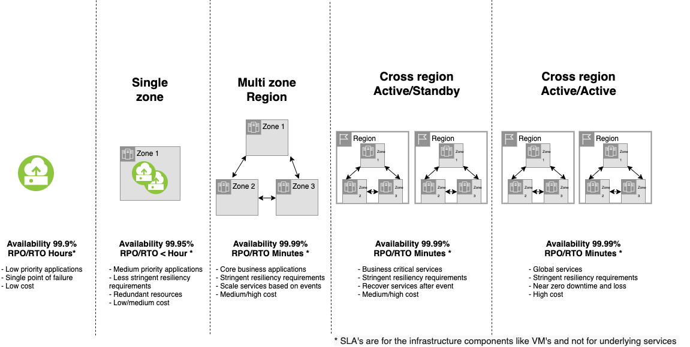

---

copyright:
  years: 2024, 2024
lastupdated: "2024-11-22"

keywords: load balancing, global load balancing, HA, DR, high availability, disaster recovery, HA for the platform, high availability for platform, disaster recovery plan, disaster event, zero downtime, workloads, failover, failover design, network resiliency, recovery time objective, recovery point objective

subcollection: design

---

{{site.data.keyword.attribute-definition-list}}

# How {{site.data.keyword.cloud_notm}} ensures high availability and redundancy
{: #ha-redundancy}

{{site.data.keyword.cloud}} provides you with a global infrastructure and portfolio of cloud services to deploy workloads and applications according to your global strategy, availability, and business continuity needs.
{: shortdesc}

## High availability through redundancy
{: #zero-downtime}

{{site.data.keyword.cloud_notm}} services are designed with different redundant deployments and fault isolation patterns depending on their location and availability scopes across the different {{site.data.keyword.cloud_notm}} regions and data centers.

Understanding how {{site.data.keyword.cloud_notm}} cloud services are designed and deployed across global {{site.data.keyword.cloud_notm}} locations helps you make appropriate choices about service dependencies and locations to help ensure that your workload and application are highly available.

## What levels of resiliency do the different zones and regions provide?
{: #landing-levels-of-resiliency}

{: caption="Levels of Resiliency" caption-side="bottom"}

Both single-zone or multi-zone data centers avoid a single-point-of-failure (SPOF) between zones and regions by providing the following:

* Multiple power feeds
* Fiber links
* Dedicated generators
* Battery backup

While all data centers have multiple power feeds, several of the more mature sites have some 1U single socket server chassis that might not accommodate a dual power feed. If you have a 1U single socket server in one of these sites, you might want to consider a 2U chassis with redundant power supplies. For more information about availability zones, see [Locations for resource deployment](/docs/overview?topic=overview-locations).
{: note}

## {{site.data.keyword.cloud_notm}} service architecture for high availability and resiliency
{: #services-architecture}

{{site.data.keyword.cloud_notm}} services are designed by implementing the following architecture patterns to achieve high availability and resiliency to different fault types that might impact the distributed {{site.data.keyword.cloud_notm}} infrastructure.

### Service data plane protection from control plane faults
{: #service-data-control-plane}

The {{site.data.keyword.cloud_notm}} service architecture separates components for the data plane and the control plane.

The data plane components are responsible for providing the primary functions of the service. Data plane components process requests from users and client applications, such as implementing data processing, persistence, load balancing, and more.

For example, the following are data plane responsibilities:

- Running and hosting the Virtual Server Instance (VSI)
- Reading and writing to block storage volumes
- Getting and setting objects into {{site.data.keyword.cos_short}} buckets
- Running, processing queries, and updates to {{site.data.keyword.databases-for-postgresql_full_notm}}

The control plane components are responsible for administering and configuring the data plane components to work. Control plane components process requests from administrators to manage the data plane lifecycle through resource creation, configuration, upgrade, and decommission phases of service instances.

For example, the following are control plane responsibilities:

- Listing the VSI in the account and provisioning a new VSI, orchestrating the creation of virtual machines from an OS image, block storage creation, attachment and configuration of the network endpoints
- Configuring, resizing, and mounting block storage volumes
- Creating new {{site.data.keyword.cos_short}} buckets

To improve resiliency and business continuity, service data planes are designed to continue to deliver their primary function even in cases of failures of the control plane. As an example, data plane access to infrastructure resources, when provisioned, has no dependency on the control plane, and therefore is not affected by any control plane issues.

Control plane failures might impact the ability to create, modify, or delete resources, but there is no impact to existing resources that remain available.

### Zonal service independence
{: #zonal-service}

Zonal services allow the request of service instances to be deployed in a specific zone of a multizone region or a specific data center.

These service instances that are deployed in a specific zone or specific data center are implemented and operated independently within its region, without dependencies on components of the services in other zones or data centers. Therefore, failures in one zone might impact the instance that is hosted in that zone but they will not impact any instance in other zones in the same region or in other regions.

Zonal service architectures use a zonal data plane that is deployed in each zone of a region and managed from the local in-region control plane component.

The user or application interacts with the service instance function by using a zonal API endpoint that is located in each target zone.

The service control plane, with some exceptions that are described in [Global service redundancy](#global-service), is located in the same region of the data plane and deployed across 3 zones of the regions. It is independent from control planes in other regions. Therefore, a control plane failure in one region might impact only service functions in that region, but not service functions in other regions.

If there is a failure of the control plane in one zone, or if a zone is unavailable, administrator requests to manage the data plane lifecycle phases like resource creation, configuration, upgrade and decommission, are performed by the control plane in the remaining two zones.

In exceptional cases where the control plane is globally deployed, it is still deployed across multiple regions to help ensure high availability. Therefore, failures in one region would not impact service functions in the other regions.

For more information about the specific options for deploying your workloads that use a zonal service, see [Locations for resource deployment](/docs/overview?topic=overview-locations) and [Considerations for high availability](/docs/overview?topic=overview-ha-considerations).

### Regional service redundancy
{: #regional-service}

Regional services allow the request of service instances to be deployed in a specific region as a whole without specifying a single target zone or data center.

These service instances that are deployed in one region are implemented and operated with redundant components that are deployed in multiple zones within the same region. This way, there is no single point of failure on any specific zone within a region.

The regional service architecture uses a regional data plane that is deployed across 3 zones in each region that is managed from the local in-region control plane. If there is a data plane failure in one zone, or if a zone is unavailable, the requests from users and client applications are automatically rerouted to the data plane in the remaining two zones.

The user or application interacts with the service instance function by using a regional API endpoint that is located in each target region.

The service control plane, with some exceptions that are described in [Global service redundancy](#global-service), is located in the same region of the data plane and deployed across 3 zones of the regions, independent from other regions control planes. This way, the control plane failures in one region might impact only the service functions in that region and not the service functions in other regions.

If there is failure of the control plane in one zone, or even complete loss, the request from administrators to manage the data plane lifecycle through the resource creation, configuration, upgrade, decommission phases of service instances are performed by the control plane on the remaining zones.

Even in the exceptional cases that the control plane is globally deployed, it is still deployed across multiple regions to help ensure high availability and to guarantee that failures in one region do not impact service functions in other regions.

For more information about the specific options for deploying your workloads that use a regional service, see [Locations for resource deployment](/docs/overview?topic=overview-locations) and [Considerations for high availability](/docs/overview?topic=overview-ha-considerations).

### Global service redundancy
{: #global-service}

A subset of {{site.data.keyword.cloud_notm}} services use a global deployment model with components that are deployed across multiple regions in different locations and geographies. These services provide common functions that other zonal or regional services depend upon. There are also specific control plane components within a service that provide global functions.

Services that use a global deployment model implement a distributed architecture with components that are replicated in multiple regions. The components are load balanced across these regions with an automatic failover design to keep the services up and running without the need of an operator's action.

The following sections detail services that use a global deployment model and their cross-region impact on dependencies from other zonal or regional services.

This approach helps remove single points of failure in your architecture, but might represent potential cross-region impacts, even when you are operating in a region that is different from where the global service control plane is hosted.

#### Global platform services
{: #global-platform}

Global platform services provide common functions that other zonal or regional services depend upon. They are control plane only that have the purpose of orchestrating user interfaces, user identities and accounts, access, billing, and so on, across all the {{site.data.keyword.cloud_notm}} global infrastructure.

The global platform services use global load-balancing strategies to help ensure a redundant, highly available platform is available for you to access and manage your cloud services.

If there is an event that impacts availability in the regions that the components of a global platform service are located, the management functions provided by the service can be degraded or not available.

The following table lists global platform services, their control plane location in {{site.data.keyword.cloud_notm}} regions, and the functions that they provide, which are not impacted unless there is an an event that impacts availability in all of the listed regions.

| Service | Management function | Location | High availability |
| -------------- | -------------- | -------------- | -------------- |
| Console  \n [Navigating the {{site.data.keyword.cloud_notm}} console](/docs/overview?topic=overview-ui) | The {{site.data.keyword.cloud_notm}} console provides the user interface that enables administrators to manage all {{site.data.keyword.cloud_notm}} resources and accounts, order new services instances, view pricing and billing information, get support, or check the status  | * us-south \n * us-east \n * eu-gb \n * eu-de \n * jp-tok \n * au-syd | Active/Active |
| Catalogs  \n [Catalog Management API](/apidocs/resource-catalog/private-catalog) | The Catalog Management service enables interaction with the {{site.data.keyword.cloud_notm}} catalog to order and provision {{site.data.keyword.cloud_notm}} service instances. You can also manage the visibility of the {{site.data.keyword.cloud_notm}} catalog and control access to products in the public catalog and private catalogs for users in your account. | * us-south \n * eu-de \n * au-syd | Active/Active |
| Global search and tagging  \n [Global Search API](/apidocs/search), [Global Tagging API](/apidocs/tagging) | The search and tagging service enables the following:  \n * Search cloud resources based on their attributes. \n * Create, delete, search, attach, or detach tags to resources. | * us-south \n * eu-gb \n * eu-de \n * au-syd | Active/Active |
| Identity and Access management  \n [IAM Identity Services API](/apidocs/iam-identity-token-api) | The IAM control plane enables the following:  \n * Authenticate and authorize the users log on and other action requests. \n * Manage service identifiers, trusted profiles, and API key identities. \n * Create, update, view, and delete IAM policies. An IAM policy enables a subject to access a resource. \n * Create, update, view, and delete access groups \n * Assign policies to users, service IDs and trusted profiles  | * us-south \n * eu-gb \n * eu-de \n * jp-tok \n * au-syd | Active/Active |
| Business Support Services   \n [User Management API](/apidocs/user-management)   \n [Usage Metering API](/apidocs/usage-metering)   \n [Usage Reports API](/apidocs/metering-reporting) | The Business Support Services enables the following:  \n * Manage accounts, enterprises, and users. \n * Manage the users in an account, such as inviting, retrieving, updating, or removing users. \n * Update user profiles and settings. \n * Collect services usage metrics and generate billing reports  | * us-south \n * us-east \n * eu-gb \n * eu-de \n * jp-tok \n * au-syd | Active/Active |
| {{site.data.keyword.cloud_notm}} Projects  \n [Projects API](/apidocs/projects) | The Project service enables the following:  \n * Create, update, view, and delete projects. \n * Deployment by using projects  | * us-south \n * us-east \n * eu-gb \n * eu-de  | Active/Active |
{: caption="Global platform services" caption-side="bottom"}

#### Services with global control planes
{: #service-global-control-plane}

Global control plane components within a service provide functions with global scope. Some operations with zonal and regional services in a specific region might have an underlying dependency on a region that is different than where the resource is located.

If there is an event that impacts availability in the regions that the components of a global platform service are located, the management operations provided by the service can be degraded or not available.

| Service | Control plane management functions | Location | High availability |
| -------------- | -------------- | -------------- | -------------- |
| Classic infrastructure resource management | The infrastructure resource management service control plane enables the following:  \n * Create, update, view, and delete Classic virtual and bare metal servers resources on Classic networks/VLANs \n * Create, update, and delete Classic networks/VLANs and Classic network routes or spans between those networks  | * us-south \n * us-east | Primary/Secondary |
| Public IP address management | Assign new public IP addresses or subnets for Internet/public load balancers, elastic IPs or virtual and bare metal servers resources with public addresses.  | * us-south \n * us-east | Primary/Secondary |
| IBMid  \n [My IBM](https://www.ibm.com/account/ca/en/){: external} | IBMid service control plane enables the following: \n * Authenticate and authorize IBMid users to log on and other action requests. \n * Create, update, view, and delete IBMid user identities.  | * us-south \n * us-east | Primary/Secondary |
| {{site.data.keyword.dns_short}}  \n [{{site.data.keyword.dns_short}} API](/apidocs/dns-svcs#introduction-to-dns-services-api) | {{site.data.keyword.dns_short}} enable the following:  \n * Create, update, view, and delete e zones that are collections for holding domain names. \n * Create, update, view, and delete DNS resource records under these zones \n * Create, update, view, and delete global load balancers to resolve hostnames to different IP addresses based on location policies.  | * us-south \n * us-east | Primary/Secondary |
| Transit Gateway  \n [Transit Gateway API](/apidocs/transit-gateway) | The Transit Gateway service control plane enables the following:  \n * Create, update, view, and delete transit gateways to connect VPCs together or with classic infrastructure networks.  \n * Attach, detach connections to VPCs or classic infrastructure networks to multiple local gateways and a single global gateway. | * us-south  \n * us-east | Primary/Secondary |
| Direct Link  \n [Direct Link API](/apidocs/direct_link) | Direct Link service control plane enables the following:  \n * Create, update, view, and delete direct links to connect VPCs or classic infrastructure networks with on-premises networks.  \n * Attach, detach connections to on-premises networks to direct links. \n * Configure import and export filters for a direct link. | * us-south  \n * us-east | Primary/Secondary |
| {{site.data.keyword.cos_short}} Provisioning | {{site.data.keyword.cos_short}} service control plane enables the following:  \n * Create or delete a new {{site.data.keyword.cos_short}} bucket with a unique global name in a region.  \n * All other control plane APIs on {{site.data.keyword.cos_short}} buckets are hosted in the same region or geography as the chosen region or geography for each {{site.data.keyword.cos_short}} bucket. | * us-south  \n * us-east | Primary/Secondary |
 {: caption="Services with global control planes" caption-side="bottom"}

For more information about best practices when you use platform services for high availability, see the following table.

| Platform service | Details |
|------------------|----------------|
|  Account management  |    [Best practices for setting up your account](/docs/account?topic=account-account_setup) and [Best practices for billing and usage](/docs/billing-usage?topic=billing-usage-best-practices)     |
| Catalogs    |    [Managing catalog settings](/docs/account?topic=account-filter-account)               |
| {{site.data.keyword.cloud-shell_short}} | [Understanding high availability and disaster recovery for Cloud Shell](/docs/cloud-shell?topic=cloud-shell-ha-dr) |
| Console | [Navigating the console](/docs/overview?topic=overview-ui) |
|      Global search and tagging         |    [Searching for resources](/docs/account?topic=account-searching-for-resources) and [Working with tags](/docs/account?topic=account-tag)        |
| IAM       |      [What is IBM Cloud Identity and Access Management?](/docs/account?topic=account-iamoverview)  |
| {{site.data.keyword.cloud_notm}} CLI | [Understanding high availability and disaster recovery for the {{site.data.keyword.cloud_notm}} CLI](/docs/cli?topic=cli-ha-dr) |
| {{site.data.keyword.cloud_notm}} projects| [Understanding high availability and disaster recovery for projects](/docs/secure-enterprise?topic=secure-enterprise-ha-dr) |
| {{site.data.keyword.compliance_short}} | [Understanding high availability](/docs/security-compliance?topic=security-compliance-ha) and [disaster recovery](/docs/security-compliance?topic=security-compliance-bc-dr) for {{site.data.keyword.compliance_short}} |
{: caption="Platform services" caption-side="top"}

### Network backbone redundancy
{: #network-backbone}

The {{site.data.keyword.cloud_notm}} network is designed such that a single point of failure never happens. Diverse, redundant connectivity exists at every point of the network by using diverse telecommunication providers for the same service connectivity whenever possible within each region.

{{site.data.keyword.cloud_notm}} uses diverse dark fiber providers to connect edge sites to all of the regional compute facilities. Additionally, each edge site has a redundant backbone of connectivity into other regions, and peers with multiple providers, directly and indirectly through a local exchange.

### Zonal and regional service isolation from cross-region dependencies
{: #zone-region-service-isolation}

In general, if there is an event that impacts availability in one region, only zonal and regional services in that region are impacted. Services in other regions are not impacted.

The data planes of zonal and regional services rely on resources within the same region, including essential dependencies like infrastructure, container orchestration, databases, security, and more.

The data plane of a service that is located in a region also depends on service instances that are provided by the user to support the following service-to-service functions:

- {{site.data.keyword.keymanagementserviceshort}} instance for bring-your-own-key (BYOK) encryption support.
- {{site.data.keyword.hscrypto}} instance for keep-your-own-key (KYOK) encryption support.
- {{site.data.keyword.cos_short}}  buckets for storing backups, Security Control Center evidence and results, archived logs, and so on, and in general for any function that supports to store or process large amount of data into or from {{site.data.keyword.cos_short}} buckets.

Carefully select the region for service allocation to help ensure availability. It is recommended to place services in the same region as dependent services to prevent the impact of cross-region failure.
{: note}

Each services documentation provides clear directions on how you can use them, the location and configuration choices, to the architecture of their applications for the wanted level of resilience.
