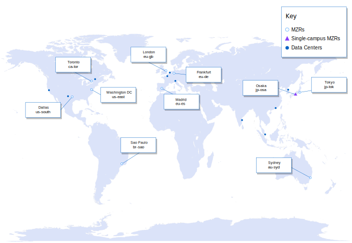
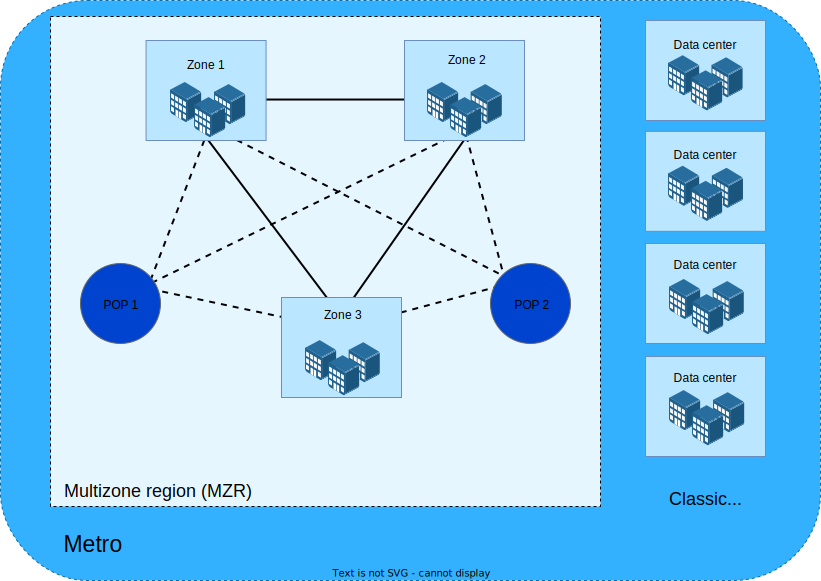

---

copyright:
  years: 2019, 2024
lastupdated: "2024-09-17"

keywords: data centers, datacenter, regions, locations, ibm cloud regions, multizone regions, MZRs, cloud regions, cloud data centers, multizone, geo, availability zone, zones

subcollection: resiliency

---

{{site.data.keyword.attribute-definition-list}}

# {{site.data.keyword.cloud_notm}} region and data center locations for resource deployment
{: #locations}

{{site.data.keyword.cloud}} has a resilient global network of locations to host your highly available cloud workload. Resources in different locations are consolidated into an account-based billing and usage view. You can also deploy your workloads to the location that is nearest to your customers to achieve low latency connectivity. {{site.data.keyword.cloud_notm}} provides [multizone regions (MZR)](#x9774820){: term}, [single-campus multizone regions (SC-MZR)](#x10127487){: term}, and classic [data centers](#x2439906){: term} for classic infrastructure resources.
{: shortdesc}

{: caption="Figure 1. MZR and data center locations map" caption-side="bottom"}

This image is an artistic representation and does not reflect actual political or geographic boundaries.
{: note}

## Regions
{: #regions}

{{site.data.keyword.IBM}} offers two types of regions: MZRs and single-campus MZRs and both are considered an MZR. The underlying infrastructure in both types provides the same [SLA](https://www.ibm.com/support/customer/csol/terms/?id=i126-9268&lc=en){: external}. A region is
an independent geographic territory that consists of one or more zones and is typically referred to by the metropolitan (metro) city area name like Dallas or London.

Each [zone](#x2070723){: term} within the region assists with improved fault tolerance and decreased latency. A zone is identified by using two separate names. There is a zone name, for example `us-south-1` that is a logical identifier for a zone in the context of the current account. There is also a universal zone name that is the identifier for a zone that is consistent across {{site.data.keyword.cloud_notm}}, for example `us-south-dal10-a`. The universal zone name provides the location specification for VPC resources by mapping the zone name to a physical location, such as a data center. Alternatively, the location for classic resources is not specified by zone and instead uses the specific data center within the region, such as `DAL10`. For more information about zone information specific to your account, see [Zone mapping per account](#zone-mapping).
{: #zone-names}

By distributing your workloads across three zones and consuming highly available regional cloud resources through virtual private endpoints, you can increase regional availability. Distributing a workload across multiple regions can provide higher availability and serve as the foundation for a disaster recovery plan. There are zonal, regional, and global cloud services that provide a consistent set of resources across regions. The {{site.data.keyword.IBM_notm}} regional services are distributed across zones in an MZR and generally provide 99.99% (tier 3) availability.

### Multizone regions
{: #table-mzr}

MZRs are composed of three or more data centers in multiple zones with independent power, cooling, and network connectivity to help ensure that failures in these components will be isolated to a single zone. MZRs provide low latency (< 2-milliseconds latency) and high bandwidth (> 1000 Gbps) connectivity within a zone.

Offering the highest level of redundancy and availability by leveraging three separate sites within a region, MZRs have a minimum distance of at least 1 mile between zones and exact distances vary by region. Zone-to-zone latency can be found in the [network latency dashboards](/docs/vpc?topic=vpc-network-latency-dashboard).

{: caption="Figure 2. Multizone region (MZR)" caption-side="bottom"}

MZRs support different types of compute for both VPC and classic infrastructure resources. The location of classic resources is specified by a data center while VPC resource locations are specified by the zone. For more information about the physical locations available for your account per region for VPC resources, see [Zone mapping per account](#zone-mapping).

The following table lists the {{site.data.keyword.cloud_notm}} MZR locations and zones for each.

| Region | Zone |
|----------|------|
| Dallas (`us-south`) | us-south-1  \n us-south-2  \n us-south-3 |
| Sao Paulo (`br-sao`) | br-sao-1  \n br-sao-2  \n br-sao-3 |
| Toronto (`ca-tor`) | ca-tor-1  \n ca-tor-2  \n ca-tor-3 |
| Washington DC (`us-east`) | us-east-1  \n us-east-2  \n us-east-3 |
{: caption="Table 1. MZRs in North and South America" caption-side="top"}
{: #americas-mzr}
{: tab-title="Americas"}
{: tab-group="mzr"}
{: class="simple-tab-table"}
{: summary="Use the buttons before the table to change the context of the table. The column headers identify the location type in the specific geographical area."}

| Region   | Zone |
|----------|------|
| Frankfurt (`eu-de`)    |eu-de-1  \n eu-de-2  \n eu-de-3 |
| London (`eu-gb`)   |eu-gb-1  \n eu-gb-2  \n eu-gb-3 |
| Madrid (`eu-es`)    |eu-es-1  \n eu-es-2  \n eu-es-3 |
{: caption="Table 1. MZRs in Europe" caption-side="top"}
{: #europe-mzr}
{: tab-title="Europe"}
{: tab-group="mzr"}
{: class="simple-tab-table"}
{: summary="Use the buttons before the table to change the context of the table. The column headers identify the location type in the specific geographical area."}

| Region   | Zone |
|----------|------|
| Sydney (`au-syd`)   |au-syd-1  \n au-syd-2  \n au-syd-3 |
| Tokyo (`jp-tok`)   |jp-tok-1  \n jp-tok-2  \n jp-tok-3 |
{: caption="Table 1. MZRs in Asia Pacific" caption-side="top"}
{: #asiapacific-mzr}
{: tab-title="Asia Pacific"}
{: tab-group="mzr"}
{: class="simple-tab-table"}
{: summary="Use the buttons before the table to change the context of the table. The column headers identify the locaiton type in the specific geographical area."}

If you're referencing a region when using the CLI, API, SDK, or Terraform, ensure that you're using the programmatic region name. For example, use `us-south` to target the Dallas (`us-south`) region.
{: note}

### Single-campus MZRs
{: #single-campus-mzr}

Single-campus MZRs (SC-MZR) contain three zones in different sections of the same building or within multiple buildings on a campus where the power, cooling, networking, and physical security dependencies overlap but are not identical between any two zones. This setup ensures a level of continuous availability and survivability of any one system outage, planned or unplanned.

SLAs are maintained because the infrastructure is set up in a concurrently maintainable fashion so that a single failure does not affect all three zones in the same campus. This setup is ideal for services that support local users as it reduces latency or to support disaster recovery workloads.

{: caption="Figure 3. Single-campus MZR" caption-side="bottom"}

The following table lists the SC-MZR locations that are available in {{site.data.keyword.cloud_notm}} and the associated regions and zones.

| Region   | Zone |
|----------|------|
| Osaka (`jp-osa`)   |jp-osa-1  \n jp-osa-2  \n jp-osa-3 |
{: caption="Table 2. single-campus MZRs" caption-side="top"}

### Zone mapping per account
{: #zone-mapping}

Within each region, there are three or more zones that are identified in the API, SDK, CLI, and Terraform by using a `regionname-number` syntax, for example `us-south-1`. Each {{site.data.keyword.cloud_notm}} account has a zone mapping for each region that determines the relationship between the zone and the physical location. The zones map to a physical location, which is referred to by a universal zone name by using a `regionname-datacenter-letter` syntax, for example `us-south-dal10-a`.

The account zone mapping is established when the first VPC resource is created in the region, and it can't be changed. You can review the assigned zone mapping for an account on the [VPC Infrastructure Overview](/vpc-ext/overview#endpoints) page in the Endpoint section. You can also use the [VPC API](/apidocs/vpc#list-region-zones) to list the mapping for your account.

Understanding your account’s zone mapping is helpful if you’re creating a mixed VPC and Power application, for example. You can create your VPC resources first, and then review your zone mapping to determine which universal zone the VPC resources are in so that you can ensure that the classic resources are created in the same physical location. Classic infrastructure and {{site.data.keyword.powerSysFull}} services locations are specified by data center while the physical location for VPC resources are specified by the universal zone name.
{: tip}

The following table shows the available physical locations by using their universal zone names, associated data centers, and available [Point of Presence (PoP)](#x5458832){: term} locations per MZR.

| Region | Universal zone names | Data center | PoP |
|------|------|----|-----|
| Dallas (`us-south`) |  us-south-dal10-a  \n us-south-dal12-a  \n us-south-dal13-a  \n us-south-dal14-a | DAL10  \n DAL12  \n DAL13  \n DAL14 | DAL03  \n DAL04 |
| Sao Paulo (`br-sao`) |  br-sao-sao01-a  \n br-sao-sao04-a  \n br-sao-sao05-a | SAO01  \n SAO04  \n SAO05 | SAO02  \n SAO03 |
| Toronto (`ca-tor`)  | ca-tor-tor01-a  \n ca-tor-tor04-a  \n ca-tor-tor05-a  | TOR01  \n TOR04  \n TOR05 | TOR02  \n TOR03 |
| Washington DC (`us-east`) | us-east-wdc04-a  \n us-east-wdc06-a  \n us-east-wdc07-a | WDC04  \n WDC06  \n WDC07 | WDC02  \n WDC05 |
{: caption="Table 3. MZR universal zone names - North and South America" caption-side="top"}
{: #americas-universal-zone}
{: tab-title="Americas"}
{: tab-group="zone"}
{: class="simple-tab-table"}
{: summary="Use the buttons before the table to change the context of the table. The column headers identify the location type."}

| Region | Universal zone names | Data center | PoP |
|----------|------|------|----|
| Frankfurt (`eu-de`)   | eu-de-fra02-a  \n eu-de-fra04-a  \n eu-de-fra05-a  | FRA02  \n FRA04  \n FRA05 | FRA01  \n FRA03 |
| London (`eu-gb`)   | eu-gb-lon04-a  \n eu-gb-lon05-a  \n eu-gb-lon06-a  | LON04  \n LON05  \n LON06 | LON01  \n LON03 |
| Madrid (`eu-es`)    | eu-es-mad02-a  \n eu-es-mad04-a  \n eu-es-mad05-a | MAD02  \n MAD04  \n MAD05 | MAD01  \n MAD03 |
{: caption="Table 3. MZR universal zone names - Europe" caption-side="top"}
{: #europe-universal-zone}
{: tab-title="Europe"}
{: tab-group="zone"}
{: class="simple-tab-table"}
{: summary="Use the buttons before the table to change the context of the table. The column headers identify the location type."}

| Region | Universal zone names | Data center | PoP |
|----------|------|------|----|
| Sydney (`au-syd`) | au-syd-syd01-a  \n au-syd-syd04-a  \n au-syd-syd05-a | SYD01  \n SYD04  \n SYD05 | MEL02  \n PER01  \n SYD02  \n SYD03 |
| Tokyo (`jp-tok`)   | jp-tok-tok02-a  \n jp-tok-tok04-a  \n jp-tok-tok05-a | TOK02  \n TOK04  \n TOK05 | TOK01  \n TOK03 |
{: caption="Table 3. MZR universal zone names - Asia Pacific" caption-side="top"}
{: #asiapacific-universal-zone}
{: tab-title="Asia Pacific"}
{: tab-group="zone"}
{: class="simple-tab-table"}
{: summary="Use the buttons before the table to change the context of the table. The column headers identify the data centers located in the specific geographical area."}

If you're referencing a region when using the CLI, API, SDK, or Terraform, ensure that you're using the programmatic region name. For example, use `us-south` to target the Dallas (`us-south`) region.
{: note}

The following table shows the available physical locations using their universal zone names, associated data centers, and available PoP locations per SC-MZR.

| Region   |  Universal zone names |Data center | PoP |
|----------|------|------|----|
| Osaka (`jp-osa`)   | jp-osa-osa21-a  \n jp-osa-osa22-a  \n jp-osa-osa23-a | OSA21  \n OSA22  \n OSA23 | OSA01 |
{: caption="Table 4. single-campus MZR universal zone names" caption-side="top"}

## Viewing resources by location
{: #filter-location}

You can view all resources and locations from the Resource list page in the console. If you want to view and work with resources in a specific location, expand the **Location** filter, and select a location from the list. By expanding a specific location, you can select to filter by regions, zones, or individual data centers.

Depending on the type of resource, you might be interested in only specific types of location data. For example, if you created a service or VPC infrastructure service, you can filter the Resource list page by the region and zone codes. However, if you're working with classic infrastructure or {{site.data.keyword.powerSys_notm}} resources, the specific data center codes are the pertinent information for you.

For example, if you have resources that are deployed in the London 2 (eu-gb-2) zone, you can set filters to display only those resources in your resource list. Expand the **London** metro option, and the **London (eu-gb)** region option. Within that region, you can select from the list of available zones, such as **London 2 (eu-gb-2)**.

If you have a classic infrastructure resource that is deployed in a specific data center, you can identify the data center by the specific metro location and alphanumeric code. For example, use **Dallas** for the metro location and then **Dallas 10 (dal10)** for the data center.

You can also view resources that are deployed in Satellite locations, which are managed by an {{site.data.keyword.Bluemix_notm}} metro or region and determines where the master of your Satellite control plane runs. For example, you might have a Satellite location that's managed by the Dallas metro. Expand the **Dallas** metro option, which includes your Satellite location, like `my-satellite-dal`. For more information about the metros and regions that manage Satellite locations, see [Regions](/docs/satellite?topic=satellite-sat-regions).

You might also want to display your resources that are located globally. The **Global** option means that only one logical, globally accessible instance of the service, independent of any region or zone, is published to customer workloads. These types of resources are accessible from a global endpoint.

As illustrated in the following graphic, a data center is a physical building that represents a zone that is located within a multizone region (MZR). An MZR is organized by its metro location. For example, London can encompass more than one grouping of data centers within an MZR. The graphic shows three zones in one MZR that work together in the instance that one of the data centers becomes unavailable. Zones are connected directly to each or through low latency links.

{: caption="Figure 4. Location hierarchy" caption-side="bottom"}

## Classic data centers
{: #data-centers}

In addition to selecting a region for your resource, you can select from a list of the {{site.data.keyword.Bluemix_notm}} data centers, if you're working with classic infrastructure or {{site.data.keyword.powerSys_notm}} resources.

Data centers host the power, cooling, compute, network, and storage resources used for services and apps. They don't provide isolation from multizones in a location.

Data centers are based on a POD architecture where each data center can have more than one POD, depending on the on-demand build out. Each POD consists of racks, servers, networks, and storage, along with backup power generators. Placing workload servers across PODs improves the availability.

See the following table for the specific code for each data center.

| Data center      | Code  |
|------------------|-------|
| Dallas 08 [^tabletext3]    | DAL08 |
| Dallas 09        | DAL09 |
| Dallas 10        | DAL10 |
| Dallas 12        | DAL12 |
| Dallas 13        | DAL13 |
| Dallas 14        | DAL14 |
| Montreal 01      | MON01 |
| San Jose 03      | SJC03 |
| San Jose 04      | SJC04 |
| Sao Paulo 01     | SAO01 |
| Sao Paulo 04     | SAO04 |
| Sao Paulo 05     | SAO05 |
| Toronto 01       | TOR01 |
| Toronto 04       | TOR04 |
| Toronto 05       | TOR05 |
| Washington DC 03 [^tabletext4] | WDC03 |
| Washington DC 04 | WDC04 |
| Washington DC 06 | WDC06 |
| Washington DC 07 | WDC07 |
{: caption="Table 5. Data centers in North and South America" caption-side="top"}
{: #americas}
{: tab-title="Americas"}
{: tab-group="dcs"}
{: class="simple-tab-table"}
{: summary="Use the buttons before the table to change the context of the table. The column headers identify the data centers located in the specific geographical area."}

[^tabletext3]: IBM Cloud for Government [Learn more](https://www.ibm.com/cloud/government)

[^tabletext4]: IBM Cloud for Government [Learn more](https://www.ibm.com/cloud/government)

| Data center  | Code  |
|--------------|-------|
|Amsterdam 03 | AMS03|
|Frankfurt 02 | FRA02|
|Frankfurt 04 | FRA04|
|Frankfurt 05 | FRA05|
|London 02 | LON02|
|London 04 | LON04|
|London 05 | LON05|
|London 06 | LON06|
|Madrid 02 | MAD02|
|Madrid 04 | MAD04|
|Madrid 05 | MAD05|
|Milan 01 | MIL01|
|Paris 01 | PAR01|
{: caption="Table 5. Data centers in Europe" caption-side="top"}
{: #europe}
{: tab-title="Europe"}
{: tab-group="dcs"}
{: class="simple-tab-table"}
{: summary="Use the buttons before the table to change the context of the table. The column headers identify the data centers located in the specific geographical area."}

| Data center  | Code  |
|--------------|-------|
|Chennai 01 | CHE01|
|Osaka 21 | OSA21|
|Osaka 22 | OSA22|
|Osaka 23 | OSA23|
|Singapore 01 | SNG01|
|Sydney 01 | SYD01|
|Sydney 04 | SYD04|
|Sydney 05 | SYD05|
|Tokyo 02 | TOK02|
|Tokyo 04 | TOK04|
|Tokyo 05 | TOK05|
{: caption="Table 5. Data centers in Asia Pacific" caption-side="top"}
{: #asiapacific}
{: tab-title="Asia Pacific"}
{: tab-group="dcs"}
{: class="simple-tab-table"}
{: summary="Use the buttons before the table to change the context of the table. The column headers identify the data centers located in the specific geographical area."}

The table includes certain data centers that are set to close soon. For the list of data centers that are closing, see [Data center closures](/docs/get-support?topic=get-support-dc-closure).
{: note}
