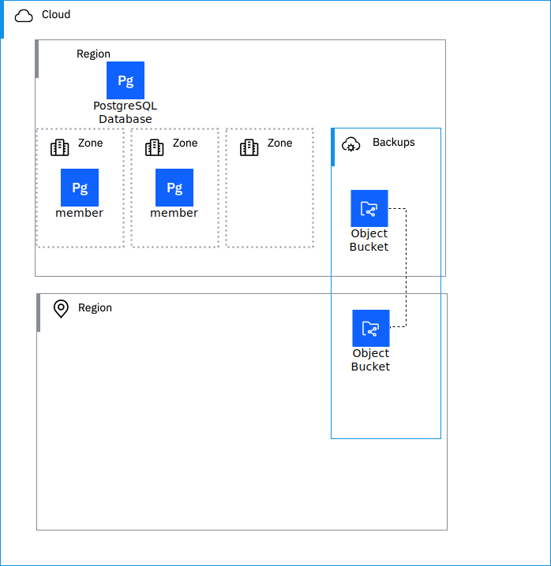

---

copyright:
  years: 2024, 2024
lastupdated: "2024-11-13"

keywords: HA, DR, high availability, disaster recovery, disaster recovery plan, disaster event, recovery time objective, recovery point objective

subcollection: resiliency

---

{{site.data.keyword.attribute-definition-list}}

# {{site.data.keyword.databases-for-postgresql}} - Understanding high availability and disaster recovery

## High Availability
{: #postgresql-high-availability}

This service is a regional service that fulfills the defined [Service Level Objectives](/docs/resiliency?topic=resiliency-slo) with the **Standard** plan.

### High Availability Architecture
{: #postgresql-high-availability-architecture}

{: caption="Postgresql architecture" caption-side="bottom"}
{: style="text-align: center;"}

{{site.data.keyword.databases-for-postgresql}} provides replication, failover, and high-availability features to protect your databases and data from infrastructure maintenance, upgrades, and some failures. Deployments contain a cluster with two data **members** - leader and replica. The replica is kept up to date using asynchronous replication. A distributed consensus mechanism is used to maintain cluster state and handle failovers. If the leader becomes unreachable, the cluster initiates a failover, and the replica is promoted to leader and a new replica rejoins the cluster as a replica. The leader and replica will always be in different zones of an MZR. If the replica fails, a new replica created. If a zone failure results in a member failing the new replica will be created in a surviving zone.

You can extend high-availability further by adding [PostgreSQL members](/docs/databases-for-postgresql?topic=databases-for-postgresql-horizontal-scaling) to the cluster, for greater in-region redundancy, or by provisioning [read-only replicas](/docs/databases-for-postgresql?topic=databases-for-postgresql-read-only-replicas) for cross-regional failover or read offloading. 

Review the PostgreSQL documentation on [replication techniques](https://www.postgresql.org/docs/current/wal-async-commit.html){: .external} to understand the constraints and tradeoffs that are associated with the asynchronous replication strategy that is deployed by default.

In scenarios where a database becomes critically unhealthy, such as a server crash on the leader, {{site.data.keyword.databases-for-postgresql}} attempts a failover. This auto failover capability is capped at 16 MB of data lag from leader to replica (a few rows of data once accounting for more PostgreSQL data overhead) and is not performed if the lag threshold is exceeded. If the potential for 16 MB of data loss is intolerable for the application, see [synchronous replication](#postgresql-sync-repl) below.

Workloads that programmatically access the cluster should follow the [client availability retry logic](/docs/doesnotexist) to maintain availability.

The service will, at times, do controlled failovers under normal operation. These failovers are no-data-loss events but result in resets of active connections. There is a period of up to 15 seconds where reconnections can fail. At times, unplanned failovers might occur due to unforeseen events on the operating environment. These can take up to 45 seconds, but generally less than 30. [Service maintenance](#postgresql-ibm-service-maintenance), for example, trigger a controlled failover.

### High Availability Options
{: #postgresql-high-availability-options}
High availability features
Feature | Description | Consideration
--|--|--
Automatic failover | Standard on all clusters and resilient against a zone or single member failure |
Member count | Minimum - 2 members. Default - 2 members. A two member cluster will automatically recover from a single instance or zone failure (with data loss up to the lag threshold). During data synchronization for a new replica the cluster has exposure to second failure causing data loss. A three member, see [adding PostgreSQL members](/docs/databases-for-postgresql?topic=databases-for-postgresql-horizontal-scaling), is resilient to the failure of two members during the same failure period | Three members required for synchronous replication
**Synchronous replication** | Improves RPO by adding remote member sync to the data write path. [Synchronous replication](#postgresql-sync-repl}) below. | Performance impact and cost.
Read-only replica | Read-only replicas can provide local access in remote regions improving availability to potential network latency or connectivity issues. | Writes can only be made to the cluster.

TODO clarify
- Loss of leader may result in data loss:
   - How does a customer get notified if less than lag threshold with associated fail over occurred?
   - When the lag threshold of data is lost - how does the customer recover that? Is it possible that a support ticket would help get the WAL file...
   - How does a customer get notified if larger than the lag threshold?

#### Synchronous replication
{: #postgresql-sync-repl}
By default, streaming replication is asynchronous. If the leader crashes, some transactions that were committed might not have synced to the replica, causing data loss. {{site.data.keyword.databases-for}} ensures that data loss is kept to a minimum substantial data loss; however, synchronous replication offers the ability to confirm that all changes were made by a transaction have been synced to a replica. This insures consistency across a cluster. This consistency come from confirming that writes are written to a secondary before returning to the connecting client with a success. For variables regarding synchronous replication, see [`synchronous_commit`](/docs/databases-for-postgresql?topic=databases-for-postgresql-changing-configuration#gen-settings) on the Changing Configuration page. 

Synchronous replication brings replica availability into the primary write path. If there is no replica to acknowledge a write it will hang until a replica is available. This requires at least three members to function reliably, as synchronous replication is not supported on two-member deployments. You _must_ horizontally scale to at least three members before synchronous replication can be enabled.  See [adding PostgreSQL members](/docs/databases-for-postgresql?topic=databases-for-postgresql-horizontal-scaling)

While unlikely, it is possible that more than one replica might become unavailable simultaneously. If this happens, the primary database will not be able to complete any writes until a replica comes back online, effectively blocking all write traffic to your database. When you are deciding to use synchronous replication, weigh the relative costs and benefits of higher data durability versus potential availability issues.

Employing synchronous replication negatively impacts the performance of the database. Typically, a performant and effective way to employ this feature is by using it only on specific databases or workloads that require the highest degree of data durability available.
{: .note}

## Disaster recovery
{: #postgresql-disaster-recovery}

The general strategy for disaster recovery to create a new database, like the `Restore` database below. The contents of the new database can be a backup of the source database created before the disaster. If the production database is available a new database can be created using the point-in-time feature.

{: caption="Postgresql architecture" caption-side="bottom"}
{: style="text-align: center;"}

## Disaster recovery options
{: #postgresql-disaster-recovery-options}

The service supports the following disaster recovery options:

Feature | Description | Consideration
-|-|-
**Backup restore** | Create database from previously created backup, see [Managing Cloud Databases backups](/docs/cloud-databases?topic=cloud-databases-dashboard-backups). | New connection strings for the restored database must be referenced throughout workload.
**Point-in-time restore** | Create database from the live production using [point-in-time recovery](/docs/databases-for-postgresql?topic=databases-for-postgresql-pitr) | Only possible if the active database is available and the RPO (disaster) falls within the supported window. Not useful if production cluster is unavailable. New connection strings for the restored database must be referenced throughout workload. 
**Promote read replica** | Create a [read-only replicas](/docs/databases-for-postgresql?topic=databases-for-postgresql-read-only-replicas) when planning for a disaster in the same or remote region. [Promote the read-only replica](/docs/databases-for-postgresql?topic=databases-for-postgresql-read-only-replicas&interface=ui#promoting-read-only-replica) to recover from a disaster. | Previously created read replica must be available. New connection strings for the restored database must be referenced for throughout workload. 

### How to use the options for business continuity

When restoring a database from backups or using point-in-time restore a new database is created with new connection strings. Existing workloads and processes will need to be adjusted to consume the new connection strings. Promoting a read replica to a cluster will have similar impact - although existing read-only portions of the workload will not be impacted.

It may be possible to restore a new database from backups or point-in-time and then use only a portion of the new database to manually restore a subset of the production database.

A recovered database may also need the same customer created dependencies of the disaster database - make sure these and other services exist in the recovered region:
- {{site.data.keyword.keymanagementservicefull}}
- {{site.data.keyword.hscrypto}}

Disaster recovery steps must be practiced on a regular basis. When building your plan consider the following failure scenarios and resolution.

Failure | Resolution
-|-
Hardware failure (single point) | IBM provides a database that is resilient from single point of hardware failure within a zone - no configuration required.
Zone failure | **Automatic failover** (#postgresql-high-availability). The database members are distributed between zones. Configuring three members will provide additional resiliency to multiple zone failures.
Zone failure | **Synchronous-replication** will reduce RPO at the expense of performance.
Data corruption | [**Backup restore**](#postgresql-disaster-recovery). Use the restored database in production or for source data to correct the corruption in restored database.
Data corruption | [**Point-in-time restore**](#postgresql-disaster-recovery). Use the restored database in production or for source data to correct the corruption in restored database.
Regional failure | [**Backup restore**](#postgresql-disaster-recovery). Use the restored database in production
Regional failure | [**Promote read replica**](#postgresql-disaster-recovery). Promote a read-only replica to a read/write database. Use the restored database in production

### Feature RTO/RPO

Each feature covered above has a related RTO/RPO time as discussed below.

Feature | RTO/RPO
-|-
**Automatic failover** | RTO = minutes, RPO = minutes (TODO populate from test results)
**Synchronous replication** | RTO = minutes, RPO = 0
**Backup restore** | RTO is based on the size of data and is approximately 10min + 1min/10GB, RPO = time of last backup (TODO real numbers)
**Point-in-time restore** | RTO 10min + 1min/10GB, RPO = 5 min  (TODO real numbers)
**Promote read replica**| RTO = 10min, RPO = 1min

### Feature check list

Disaster recovery steps must be practiced on a regular basis. The following check list can help you create and practice your plan.

**Automatic failover** - Use monitoring to detect failover with lag or failover failure, Todo get description from team.

**Synchronous replication**
- Verify the [member count](/not-fount-yet) is set to three.
- Verify that [synchronous replication](/todo) is configured.

**Backup restore** 
- Verify backups are available at desired frequency to meet RPO requirements. [Managing Cloud Databases backups](/docs/cloud-databases?topic=cloud-databases-dashboard-backups) documents backup frequency. Consider a script using [IBM Cloud® Code Engine - Working with the Periodic timer (cron) event producer](/docs/codeengine?topic=codeengine-subscribe-cron) to create additional on-demand backups to improve RPO if the criticality and size of the database allow.
- There are some restrictions on database restore regions - verify your restore goals can be achieved by reading [managing Cloud Databases backups](/docs/cloud-databases?topic=cloud-databases-dashboard-backups).
- Verify the retention period of the backups meet your requirements.
- Verify the RTO time for restoring a database is met - keeping in mind the size of the database will increase the restore time - consider breaking one large database in to multiple smaller ones and purging unused data.
- Verify the Key Protect service ... yada yada - todo what needs to be done here?

**Point-in-time restore**
- Verify the procedures covered earlier.
- Verify desired backup is in the window.

**Promote read replica** 
- Verify that a read replica exists in the recovery region.
- Practice the promotion process - create a temporary read replica in the desired region. The temporary replica can be promoted to read/write and some testing performed with little impact to production.

### Additional DR considerations

Keep in mind that when a database is deleted the associated backups are deleted as well. For a limited time a deleted database can be reclaimed - see [What happens to the backups if I accidentally delete an instance?](/docs/cloud-databases?topic=cloud-databases-faq-backups).

It is not possible to copy backups off the {{site.data.keyword.cloud_notm}} so consider using the database specific tools for additional backup. It may be required to recover from malicious database deletion followed by a reclamation-delete of a database. Careful management of IAM access to databases can help reduce exposure to this problem.

## IBM disaster recovery
{: #postgresql-ibm-disaster-recovery}

### IBM recovery from zone failure 
{: #postgresql-ibm-recovery-from-zone-failure}

The database is resilient from a single zone failure as described above.

### IBM recovery from regional failure
{: #postgresql-ibm-recovery-from-regional-failure}

After a regional has failed and has then been restored IBM will attempt to restore the cluster in the same region with the same connection strings from the last state in internal persistent storage.
- RTO - TODO
- RPO - TODO

In the event that IBM can not restore the database, the customer must restore the database using one of the disaster recovery features described above.

## IBM Service Maintenance
{: #postgresql-ibm-service-maintenance}

All upgrades follow the IBM service best practices and have a recovery plan and rollback process in-place. Regular upgrades for new features and maintenance occur as part of normal operations. Such maintenance can occasionally cause short interruption intervals that will be handled by [client availability retry logic](/docs/doesnotexist) within client applications. Changes are initially rolled out sequentially on a region-by-region basis.

Complex changes are enabled/disabled with feature flags to control exposure.
- TODO is this true?  Do a number of changes get dropped in from the postgresql open source?

Changes that impact customer workloads will be described by notifications. See [monitoring notifications and status](/docs/account?topic=account-viewing-cloud-status) for planned maintenance, announcements, and release notes that impact this service.

---

END OF TOPIC - rest is notes

## Links
- [Understanding high availability for Cloud Databases](/docs/cloud-databases?topic=cloud-databases-ha-dr)
- [Understanding business continuity and disaster recovery for Cloud Databases](/docs/cloud-databases?topic=cloud-databases-bc-dr)
- [Shared responsibilities for Cloud Databases](/docs/cloud-databases?topic=cloud-databases-responsibilities-cloud-databases)
- [High availability - Databases for PostgreSQL](/docs/databases-for-postgresql?topic=databases-for-postgresql-high-availability)
- [The high-availability read-only replica - Databases for PostgreSQL](/docs/databases-for-postgresql?topic=databases-for-postgresql-the-ha-read-only-replica)

## Author section TODO Remove
## Author Links
- [caixa ppt](https://ibm.ent.box.com/file/1475809619207)
- [caixa video](https://ibm.ent.box.com/file/1381668930397?s=1ivunygo476n389ocva8l3dr7kt14mu2)
- [caixa folder](https://ibm.ent.box.com/folder/235605829430)

## Author Questions
- [ ] Why is SC-MZR backups stored in SC-MZR buckets? How do I move these to a different region for restore in case of the SC-MZR failure
- [ ] Not following the logic of the following statement:
> If a single-campus multizone region failure in an MZR or a hardware failure in any region occurs, your data is still accessible as it is replicated onto other fully functioning database servers. Such issues are addressed by IBM Cloud® Specialists in place.
- [ ] `deployment` - cluster
- [ ] only if I have more than one region?  I have to deploy monitoring or what - no customer support?
> If you have deployments in more than one region, you must provision IBM Cloud® Monitoring and enable platform metrics in each region. For more information, see IBM Cloud Monitoring integration.

---
Deleted content

## Connection limits
{: #postgresql-connection-limits-ha}

{{site.data.keyword.databases-for-postgresql}} sets the maximum number of connections to your PostgreSQL database to **115**. 15 connections are reserved for the superuser to maintain the state and integrity of your database, and 100 connections are available for you and your applications. After the connection limit is reached, any attempts at starting a new connection results in an error. To prevent overwhelming your deployment with connections, use connection pooling, or scale your deployment and increase its connection limit. For more information, see the [Managing PostgreSQL connections](/docs/databases-for-postgresql?topic=databases-for-postgresql-managing-connections) page.

There is a period of up to 15 seconds where reconnections can fail. At times, unplanned failovers might occur due to unforeseen events on the operating environment. These can take up to 45 seconds, but can be less. In both cases, potential exists for the downtime to be longer.

## High availability, disaster recovery, and SLA resources
{: #ha-recovery-sla}

{{site.data.keyword.databases-for-postgresql}} deployments conform to the {{site.data.keyword.cloud_notm}} Databases [High availability, Disaster recovery, and Service Level Agreement (SLA)](/docs/cloud-databases?topic=cloud-databases-ha-dr) information and terms.

## General DR Guidance

Backups are placed in a cross-regional Object Storage bucket, which enables them to be restored in any region (though not across compliance boundaries) and even across accounts, if using the API and sufficient account access is granted.

A point to remember with IBM Cloud database backups is that backups can only be restored by creating a new instance - you cannot have an existing instance and apply backups to it in a cumulative manner. The tine it takes to fully restore a database may range from minutes, to hours, even to days, depending on the amount of data that it stores. It's therefore important to test restores to have some indication as to how long the restore process might take, baring in mind, this may still only provide a rough indication, since restores can be affected by many different factors. If the restore process is longer than desired, then consider breaking the database down into several, smaller instances or taking other actions - such as purging old data - which has the effect of reducing the overall size of the database.

A number of IBM Cloud Databases, including PostgreSQL, EnterpriseDB and MySQL, also support Read-only Replicas. These are replicated databases that are set up in a Master / Replica configuration where the master sends changes to the replica and those changes are applied to the replica instance asynchronously. Under normal operation, the replica can only be used for read transactions, so can support read-intensive operations, such as reporting. In a DR situation, a read-only replica can be promoted to a read-write, stand-alone instance, with and RTO/RPO of minutes. Once completed, client connection strings will need to be redirected to this instance.

While loss of the database is one scenario to consider, another is corruption of the data it stores. Data corruption within databases can be caused by multiple means, inculding malfunctioning software, bad disks and even through the hands of users, whether accidental or deliberate. Sometimes this corruption can be quickly identified, other times, it may take a lot longer for a data problem to be spotted. Remember that if you rely solely on read-replica databases for disaster recovery, then it is likely the replica will also contain any data corruption, which may be difficult to reverse, if at all - so taking backups as well as having read-replicas is advised. It's therefore important to think about how data corruption might affect the databases your workloads rely on, and how to recover from that corruption. If the corruption is discovered quicky, then using database backups taken before the corruption occured may be a way to recover. If the corruption is discovered more slowly, then other means of repair may need to be considered, such as scripting to directly fix data. The tactic deployed will usaully depend on factors such as potential for data loss.
